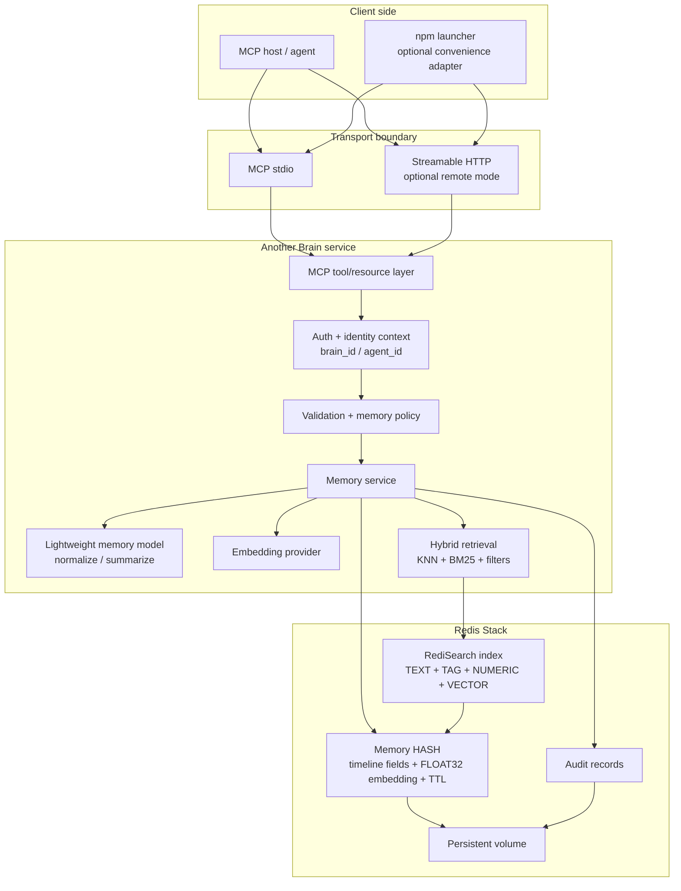
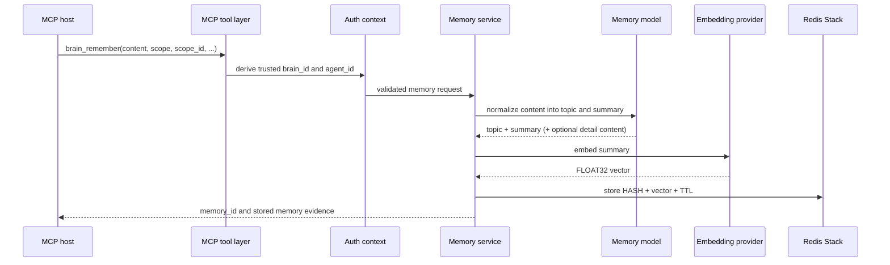
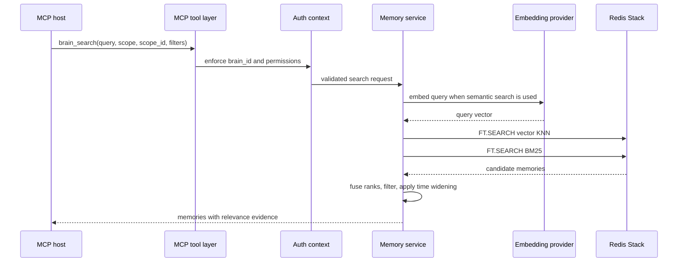
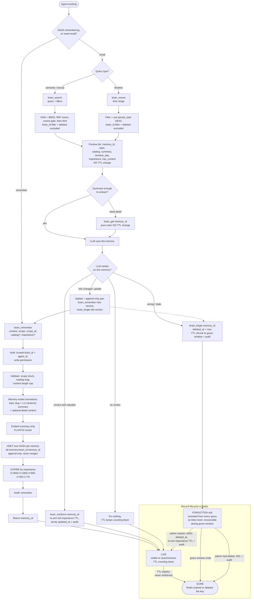

# Step 01 - Architecture Foundation

This is the first small review slice for Another Brain. It defines the system
shape only. It does not choose a framework, create runtime code, add Docker, or
define exact test commands.

## Current Repo State

The repository is documentation-only right now:

- `README.md`
- `.agents/README.md`
- `.agents/PROJECT_CONTEXT.md`
- `.agents/AGENT_RULES.md`
- `.agents/TESTING_GUIDE.md`
- `.agents/plans/another-brain-architecture.md`

There is now a non-runnable placeholder scaffold under `src/`, `docs/`,
`docker/`, `packages/`, and `tests/`. There is no package manifest, Docker file,
Compose file, env example, implementation logic, or executable test suite yet.
Treat all runtime pieces below as intended architecture.

## One Sentence

Another Brain is a standalone MCP-first timeline memory service that lets many
agents write and recall shared long-term memory through a stable `brain_*`
tool surface.

## System Boundary

Another Brain owns:

- memory tool contracts;
- trusted identity context: `brain_id`, `agent_id`;
- validation and memory policy;
- content normalization (topic + summary, multilingual-safe);
- embedding generation;
- timeline storage and retrieval;
- retention and soft delete policy;
- health/status output.

Another Brain does not own:

- any client agent loop;
- chat persona behavior;
- Discord or project-specific integrations;
- a frontend UI;
- a separate vector database for MVP.

## Component View

## First Write Path

MVP should start with explicit memory writes. Raw observation ingest can come
later.

## First Read Path

Search should be hybrid from the start because exact names, ids, paths, and
commands need lexical recall while paraphrased memories need semantic recall.

## Memory Lifecycle (Activity View)

One activity diagram for the whole memory flow: how a memory is written, how
it is recalled, how the LLM closes the loop after using it, and how the
record moves through its Redis lifecycle. There is deliberately no
`brain_update` tool — the store is append-only (Step 04, decision 11), so an
update is expressed as `brain_remember` (new version) plus `brain_forget`
(old version). TTL renewal is never a code side effect: only an explicit
`brain_reinforce` re-arms it (Step 04, decision 9).

Reading notes:

- Every read (`brain_search`, `brain_recent`, `brain_get`) is pure — no read
  ever re-arms TTL. The only paths back to a fresh TTL are `brain_reinforce`
  and admin restore.
- The "no verdict" branch is the designed failure direction: an untouched
  memory simply expires at its importance baseline. The system fails toward
  forgetting, never toward bloat.
- `brain_health` is outside this flow — it is a status probe, not a memory
  operation.

## Minimum Public Surface

Step 01 assumes these tool names, but detailed schemas should be reviewed in a
later API step:

- `brain_remember`
- `brain_search`
- `brain_recent`
- `brain_get`
- `brain_reinforce`
- `brain_forget`
- `brain_health`

`brain_ingest` is intentionally outside the first slice.

## Storage Direction

Use Redis Stack as the MVP storage system:

- one Redis HASH per memory;
- packed FLOAT32 embedding stored on the same HASH;
- RediSearch index over text, tags, numeric time fields, and vector field;
- Redis TTL for retention;
- `brain_id` filter required for every query.

Do not introduce a separate vector database in the first implementation.

## Review Decisions

Approve or change these before moving to Step 02:

1. Another Brain is MCP-first and has no frontend in the initial architecture.
2. Docker service is the primary deployment shape; npm is only a launcher or
   adapter.
3. Redis Stack is the only MVP database, search engine, vector store, and TTL
   mechanism.
4. `brain_id` is the storage isolation boundary.
5. `agent_id` is provenance and permission context, not the default memory
   namespace.
6. First write path is `brain_remember`; raw observation ingest comes later.
7. Search is hybrid from the start: vector KNN plus BM25 through RediSearch.

## Next Slice After Approval

Step 02 should define directory names, module names, and the first class names.
After that, Step 03 should define the memory record and Redis index contract:

- memory fields;
- Redis key format;
- RediSearch schema;
- TTL policy;
- migration/reindex rules.
