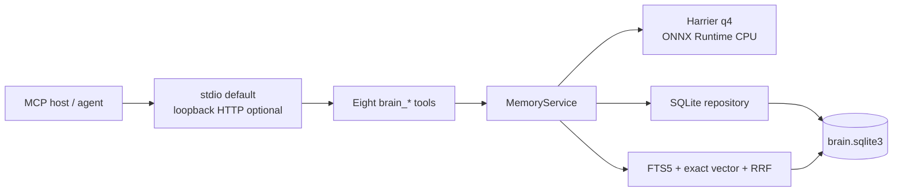
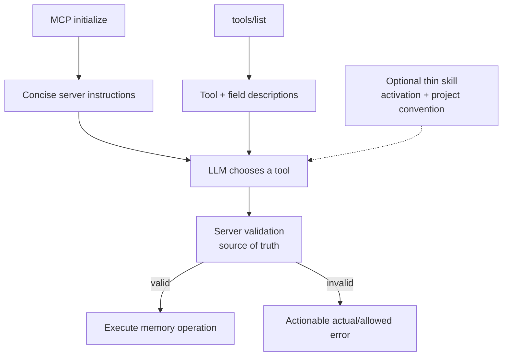
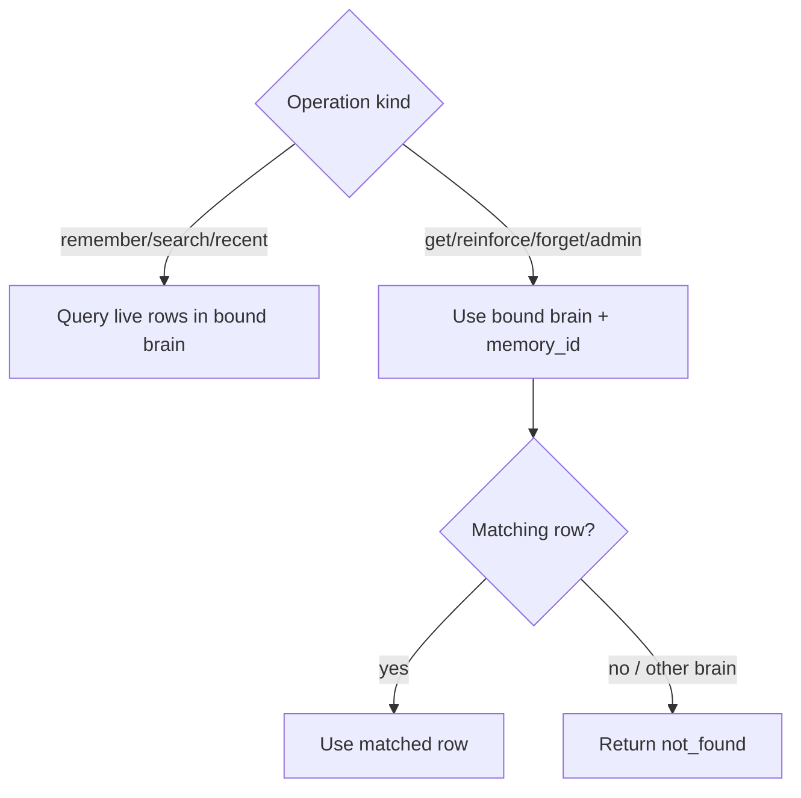
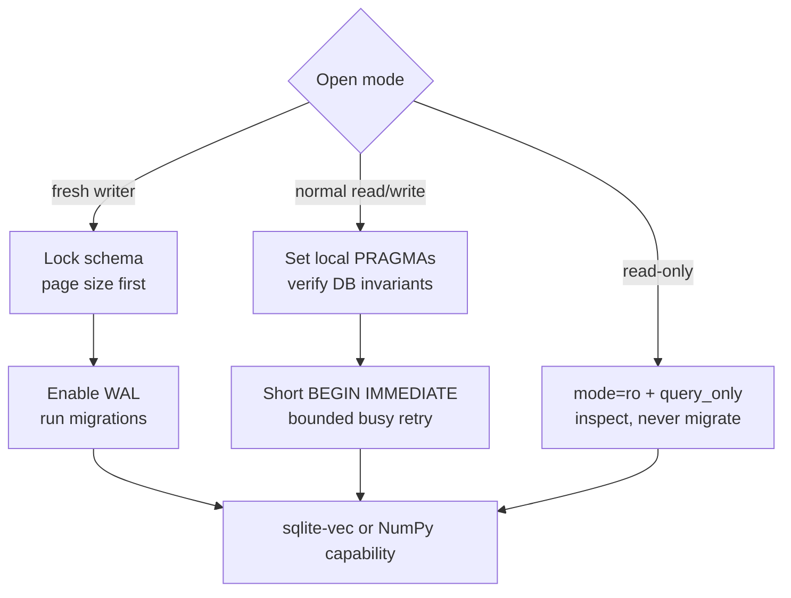
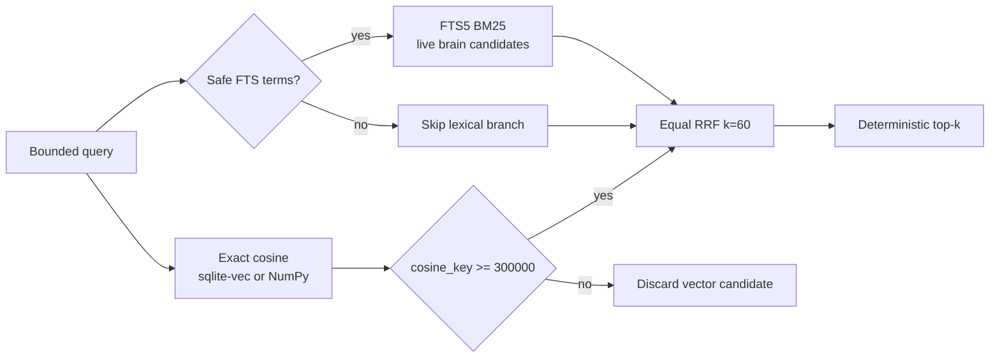
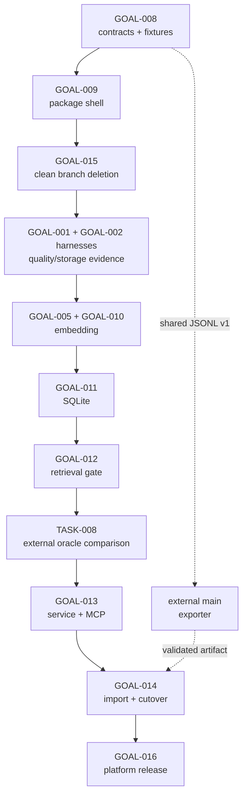
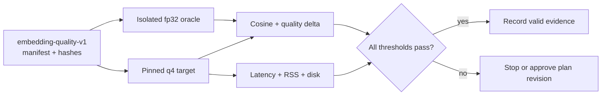
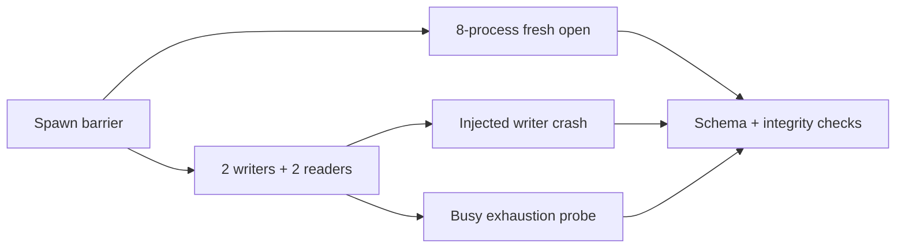
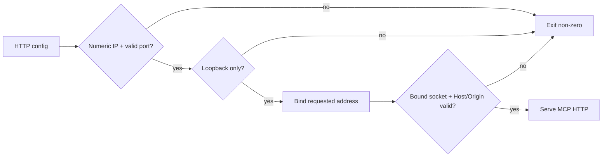
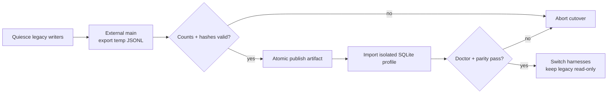

# Plan 07 — Clean embedded rebuild (remove Docker, Redis, and Torch)

## Summary

Rebuild another-brain as a standalone, lightweight MCP tool whose final source,
wheel, normal runtime, tests, install path, and documentation contain no Docker
or Redis dependency. The target stack is:

- ordinary SQLite tables as the single source of truth;
- SQLite FTS5 for weighted lexical/BM25 retrieval;
- `sqlite-vec` scalar `vec_distance_cosine` for exact vector retrieval, with a
  NumPy exact-scan fallback when the extension is unavailable;
- app-layer reciprocal-rank fusion (RRF);
- raw ONNX Runtime CPU + Hugging Face `tokenizers`;
- pinned Harrier OSS v1 270M ordinary q4 weights;
- MCP stdio as the default transport and a packaged `another-brain` executable.

The plan uses ten small Mermaid diagrams rather than one dense graph: runtime,
identity dispatch, guidance layering, SQLite connection modes, retrieval,
execution dependencies, Q4 evidence, concurrency, HTTP security, and migration
cutover. Each diagram is placed beside the contract it explains so the
document can be read side by side without a separate call graph.

### Replacement strategy — use `main` as the external oracle, delete early

Redis and Docker do **not** need to remain in branch `v0.11.0`. The complete
legacy implementation is permanently available on `main` at baseline commit
`edc0e57` (or a later explicitly recorded maintenance commit). When comparison
is needed, run it from a separate Git worktree; never switch or copy Redis code
back into the clean branch:

```bash
git worktree add ../another-brain-main main
```

Therefore the clean branch uses this order:

1. Approve the desired contracts and record the exact `main` oracle commit.
2. Establish the final `src/another_brain/` package shell and preserve only
   backend-neutral domain/tool response contracts.
3. Delete Redis, Docker, Torch/SentenceTransformers, their config, tests,
   dependencies, and old composition from `v0.11.0` **before** implementing the
   new storage/retrieval modules. Keep the branch green with package/domain
   tests; temporary feature incompleteness is acceptable inside the
   in-progress major-version branch.
4. Build SQLite, FTS5, scalar vector retrieval, RRF, ONNX q4, service, and MCP
   vertically in the clean tree. There is no `STORAGE_BACKEND` flag and no
   Redis implementation of the new protocols.
5. Compare against `main` only through deterministic fixtures, JSONL artifacts,
   or an external worktree process.
6. Perform final migration/cutover and release gates without ever reinstalling
   Redis or Docker in `v0.11.0`.

A Redis JSONL exporter belongs to a maintenance commit/release based on `main`,
not to this branch. `v0.11.0` contains only the neutral JSONL importer.

The old hybrid ranking is **not** an oracle where it is known to be wrong. Its
universal cosine gate can discard an exact `content` BM25 match because only
`topic + summary` is embedded. The new retrieval contract fixes that behavior:
pure lexical candidates do not need to pass the vector cosine floor.

### Locked product decisions

1. **Canonical store** — regular SQLite tables, not `vec0`, LanceDB, DuckDB,
   Redis, or an ANN sidecar.
2. **Lexical retrieval** — FTS5 indexes `topic`, `summary`, and `content` with
   initial BM25 field weights `5:3:1` and `unicode61 remove_diacritics 2`.
3. **Vector retrieval** — one normalized FLOAT32[640] vector per memory,
   searched exactly with `vec_distance_cosine`; NumPy is the compatibility
   fallback.
4. **Fusion** — equal-weight two-branch RRF with `k=60`; search `top_k=5`
   and `candidate_limit=50` per branch are fixed product contracts for the MVP.
   Vector candidates must meet cosine `>=0.30`, while lexical candidates remain
   eligible without a cosine gate. Final ordering is deterministic. RRF `k=60`
   remains an independent score-smoothing constant.
5. **Embedding runtime** — raw `onnxruntime` CPUExecutionProvider plus
   `tokenizers`; the ONNX graph already returns normalized
   `sentence_embedding [batch, 640]`.
6. **Model artifact** — repository
   `onnx-community/harrier-oss-v1-270m-ONNX` at immutable revision
   `d59c919d0159aea2c19ed7d04288fcdd048d0f9c`. Required files and SHA-256:
   - `onnx/model_q4.onnx` —
     `228dca2603b907d673dd99cf89c309c0ca68baeed127416a5e027a48e62b0f49`
   - `onnx/model_q4.onnx_data` —
     `b5a15487360f5341659480ae4b5ad60028d5f865bd329196ec8d5708bbed3118`
   - `config.json` —
     `5366f9919a82aaeceb6707bf218c5769f414d60f5dbaf781fa07e5465487fd7c`
   - `tokenizer.json` —
     `ec95be298bea26f90370854faa650744c9fb0a04ca5e5ff95dd3913393ac5e45`
   - `tokenizer_config.json` —
     `135405f3479eaebc473e2e78593f2195c7598948a215ee748758def426b30f59`
7. **Input payload v2** — documents use exactly
   `topic.replace("-", " ") + "\n" + summary.strip()` with no prompt. Queries
   use exactly `QUERY_PROMPT + query.strip()`, where `QUERY_PROMPT` is
   `"Instruct: Given a web search query, retrieve relevant passages that answer the query\nQuery: "`
   (UTF-8 SHA-256
   `df4b2898bf22e00bacddddd489243a3f8793730e38b842ec10161cebd94d36d6`).
   Empty stripped queries are rejected. `content` is lexical-only; catalog,
   metadata, time, and importance are filters/provenance.
8. **Topic contract** — a lowercase-kebab stable retrieval subject reusable by
   related diary entries. Count the humanized slug without special tokens;
   target 3–8 Harrier tokens, hard maximum 12. Do not duplicate catalog, use
   transient workflow labels, or stuff keywords.
9. **Token budgets** — count with the pinned Harrier tokenizer only:
   - humanized topic: max 12, no special tokens;
   - final topic+summary document: max 256, including special tokens;
   - final query-prompt+query: max 128, including special tokens;
   - lexical-only content: max 1,024, no special tokens.
   Reject over-limit input with actual/allowed counts; never truncate or chunk.
10. **Durable lifecycle** — persist `expires_at`; importance 5..1 maps to
    365/180/90/30/7 days. Every live read and both retrieval branches exclude
    `expires_at <= now` and `deleted_at IS NOT NULL` before limits. Forget sets
    `deleted_at` and `expires_at=min(current_expires_at, now+30 days)`; it never
    extends life. Reinforce and restore re-arm from importance transactionally.
11. **Concurrency** — independent stdio processes share one SQLite file through
    WAL, `busy_timeout`, bounded write retries, short transactions, and locked
    schema/model installation.
12. **Install contract** — `[project.scripts] another-brain =
    "another_brain.cli:main"`; `uv tool install another-brain`, then invoke the
    installed `another-brain` executable. Harness configs do not use unpinned
    `uvx`. In stdio mode stdout is reserved exclusively for MCP frames; logs,
    progress, and diagnostics go to stderr.
13. **SDK/package line** — use Python MCP SDK `mcp>=2.0,<2.1` and its
    `MCPServer`/Streamable HTTP APIs, not the pre-2.0 in-SDK `FastMCP` surface.
    Use a Hatchling src-layout build; dependency ranges are locked in TASK-037
    and exact versions in `uv.lock`.
14. **Audit** — persist only mutation structure, never topic/summary/content or
    metadata. Retain events for 90 days by `event_at`; cleanup is bounded and
    best effort and cannot roll back an already committed memory mutation.

### Runtime and identity flows



`brain_id` is always bound from process configuration and `agent_id` from the
MCP handshake; neither is accepted as a tool argument. The stable tool names
are `brain_remember`, `brain_search`, `brain_recent`, `brain_get`,
`brain_reinforce`, `brain_forget`, `brain_health`, and `brain_audit`.
Collection operations are bound to the process `brain_id` and filter live
rows only; there is no second partition.

Public IDs are unique per brain with `UNIQUE(brain_id, memory_id)`. The stable
by-ID tools `brain_get`, `brain_reinforce`, and `brain_forget`, plus admin
restore/hard-delete, intentionally keep a `memory_id`-only public signature.
Their repository key is `(bound brain_id, memory_id)`. An ID that exists only in a
different brain returns the same `not_found` shape as an unknown ID. Live by-ID
reads exclude expired/deleted rows; restore may address a soft-deleted row still
inside its grace window, and hard-delete may address a live or soft-deleted row.
Audit day reads are keyed by `(brain_id, day)`.

### Guidance without a mandatory skill

Core correctness never depends on installing `skills/another-brain/SKILL.md`.
The server owns validation and actionable errors; concise MCP server
instructions teach the global search/get/reinforce/forget loop; each tool and
input field has a self-contained description sufficient for a client that only
exposes `initialize` and `tools/list`. Clients may ignore server instructions,
so a correctness-relevant rule must live in validation and the relevant tool
schema/description rather than instructions alone.

The skill remains an optional 100–200-word behavior adapter. It contains only
proactive activation guidance, the claims-not-facts stance, and the
close-the-loop policy. It does not duplicate
token budgets, storage/retrieval internals, TTL tables, or tool schemas. A host
with no installed skill must still complete remember → search → get → reinforce
or forget correctly; the only lost behavior may be proactive search timing.





### Target module boundaries

```text
src/another_brain/
  cli.py                         command parser and console entry point
  app.py                         composition root and resource lifecycle
  config.py                      Redis-free runtime configuration
  domain/
    models.py                    diary, identity, filters, search result
    retention.py                 importance -> durable expiry policy
  embedding/
    manifest.py                  pinned model/artifact/input contract
    installer.py                 verified download + cross-process lock
    provider.py                  raw ONNX Runtime provider
    payload.py                   topic+summary and query construction
    budgets.py                   tokenizer-based hard limits
  storage/
    connection.py                SQLite connection policy and busy retry
    schema.py                    DDL and migration runner
    repository.py                memory CRUD and lifecycle
    audit.py                     secret-free SQLite audit persistence
  retrieval/
    query.py                     safe FTS5 query construction
    lexical.py                   FTS5 candidate source
    vector.py                    sqlite-vec/NumPy exact candidate source
    fusion.py                    deterministic RRF
    service.py                   hybrid orchestration
  mcp/
    tools.py                     stable brain_* tool surface
    server.py                    stdio and optional loopback HTTP
```

Protocols exist for service isolation and unit tests, not backend selection:

```text
MemoryRepository: store/get/recent/reinforce/soft_delete/restore/hard_delete
MemoryRetriever:  search(query text + vector + filters) -> previews
AuditRepository:  record/list_day
EmbeddingProvider: embed_document/embed_query + health state
```

### SQLite schema contract

One database file (`brain.sqlite3`) contains:

- `schema_migrations(version, checksum, applied_at)`;
- `embedding_profiles` with model, source/artifact revisions, q4 variant,
  dimension, dtype, normalization, query prompt, and input version;
- `memories` with internal integer `row_id`, public identity, topic,
  catalog, summary, content, timeline fields, importance, `expires_at`,
  `deleted_at`, metadata JSON, embedding profile, FLOAT32 embedding BLOB, and
  record version;
- external-content `memory_fts(topic, summary, content)` with insert/delete/
  update triggers;
- `import_runs(export_id, artifact_sha256, format_version, status,
  last_committed_seq, imported_count, skipped_count, failed_count, started_at,
  completed_at)` for durable JSONL resume checkpoints;
- `audit_events` containing structural mutation facts and no memory text.

All timestamps are signed INTEGER Unix epoch milliseconds; `timeline_day` is
`YYYY-MM-DD` in configured timezone. Schema v1 locks these columns and checks:

- `schema_migrations`: integer `version` primary key, SHA-256 `checksum`,
  `applied_at`;
- `embedding_profiles`: text `profile_id` primary key, model/source/artifact
  revisions, variant, dimension, dtype, normalized flag, tokenizer/config/prompt
  hashes, query prompt, input version, and `created_at`; the active contract is
  dimension 640, `float32-le`, normalized, input version 2;
- `memories`: integer `row_id` primary key; text `memory_id`, `brain_id`,
  `agent_id`, topic/catalog/summary/content; timeline and
  period timestamps; importance, expiry/deletion, metadata JSON, profile FK,
  embedding BLOB, and positive `record_version`. Enforce importance 1..5,
  non-empty identity/text fields, valid JSON object metadata, ordered period,
  `updated_at>=created_at`, `UNIQUE(brain_id,memory_id)`, and 2,560-byte BLOB;
- `audit_events`: text `event_id` primary key, `brain_id`, `memory_id`, acting
  `agent_id`, allowed mutation `action`, INTEGER `event_at`, text
  `timeline_day`, and valid object `detail_json`; intentionally no memory FK so
  hard-delete and skipped expired imports preserve audit history;
- `import_runs`: UUID `export_id` primary key, unique artifact SHA-256, format
  version, status in `running|completed|failed`, last committed sequence,
  non-negative counters, and start/completion timestamps.

v1 was edited in place before release to drop the `scope`/`scope_id`
partition columns and reshape the recent/topic/catalog indexes brain-first
(TASK-057 revision, sub-plan 07.07). Because v1 is unreleased, stores built
from the pre-edit draft fail the migration-ledger checksum.

`memory_fts` is FTS5 external content over `memories(row_id)` with
`unicode61 remove_diacritics 2`; insert/update/delete triggers mirror every
persisted memory row. Live filtering therefore occurs in the mandatory
join, not by deleting soft-deleted/expired rows from FTS. Required indexes are
the unique by-ID key; brain-first recent/topic/catalog indexes carrying deletion and
expiry; an expiry purge index; a deleted-grace index; and
`audit_events(brain_id,timeline_day,event_at DESC,event_id ASC)`. Recent ordering
is `created_at DESC,memory_id ASC`; audit day ordering is
`event_at DESC,event_id ASC`.

`memories.embedding` is little-endian FLOAT32 and has
`CHECK(length(embedding)=2560)`. The active embedding profile is q4,
640-dimensional, normalized, and `embedding_input_version=2`. Changing the
model, precision, dimension, tokenizer, prompt, or document payload is an
explicit migration and re-embedding operation.

Connection behavior is split by privilege and database state:

1. **Bootstrap/schema writer** — hold the cross-process schema lock; open
   read/write in autocommit mode; set `busy_timeout=5000` and
   `foreign_keys=ON`; on a fresh database (`page_count=0`) set and verify
   `page_size=16384` before creating the first object; then set and verify WAL
   and `synchronous=NORMAL`. A non-empty database with the wrong page size
   fails fast rather than running an implicit `VACUUM`. Load sqlite-vec only
   through a narrow enable-load-disable window, then run checksummed migrations.
2. **Normal read/write** — set connection-local `foreign_keys=ON`,
   `busy_timeout=5000`, and `synchronous=NORMAL`; verify WAL, page size, schema,
   and profile. Load sqlite-vec per connection or record NumPy fallback. Writes
   use short `BEGIN IMMEDIATE` transactions. Retry the whole transaction only
   for `SQLITE_BUSY`/`SQLITE_LOCKED`, rolling back before bounded exponential
   backoff with jitter; validation and integrity failures are never retried.
3. **Read-only** — open URI `mode=ro`, set `query_only=ON`,
   `foreign_keys=ON`, and `busy_timeout=5000`; inspect but do not mutate journal
   mode, page size, schema, or profile. Do not migrate, purge, or create. Try the
   scalar extension only where the driver permits it; otherwise use NumPy.

No flow performs model inference, tokenization, or network I/O inside a
transaction. Every connection is process-local, context-managed, and closed in
a `finally` path.



### Retrieval contract

For fixed `top_k=5`, each branch requests fixed `candidate_limit=50` after
mandatory brain, expiry, and deletion filters.

- Lexical: safe OR query over tokenizer-compatible terms, FTS5 BM25 ascending,
  field weights topic=5, summary=3, content=1, ties by `memory_id ASC`.
- Vector: exact cosine distance ascending; discard candidates below cosine
  0.30 before one-based candidate rank.
- Fusion: `1 / (60 + rank)` for one-based rank from each branch, equal branch
  weights; a document present in both receives both contributions.
- Lexical-only candidates remain valid. This is the deliberate fix for the
  current content-match/cosine-gate bug.
- Stable tie break: fused score descending, branch count descending, best
  branch rank ascending, then `memory_id` ascending.
- A query with no safe lexical terms uses vector retrieval only.

For cross-platform parity, both vector adapters return finite FLOAT32 cosine.
Diagnostics allow `abs(sqlite_vec_score - numpy_score) <= 1e-6` with zero
relative tolerance. Both adapters are canonicalized in the app layer as integer
micro-cosine `cosine_key = round(float(score) * 1_000_000)` using Python's
half-even `round`; candidates pass when `cosine_key >= 300000`, and each vector
branch sorts by `cosine_key DESC, memory_id ASC`. The parity gate requires exact
candidate IDs, order, branch ranks, and final RRF output; it does not require
bit-identical raw floats. Fixtures cover `0.299998`, `0.300000`, `0.300002`,
equal-score ties, malformed/non-finite embeddings, and rounding-boundary gaps.



## Success criteria

1. A clean built wheel installs with `uv tool install` on the required matrix:
   Windows x86_64, macOS 14+ ARM64, and Ubuntu 22.04/24.04 x86_64 using Python
   3.12–3.14.
2. Bare `another-brain` starts MCP stdio; a fresh profile performs remember →
   search → get → reinforce → forget without Docker, Redis, Torch, or network
   access after model installation.
3. Direct runtime dependencies are limited to MCP, ONNX Runtime, Tokenizers,
   NumPy, `platformdirs`, `sqlite-vec`, and `filelock`; forbidden families are
   absent from the complete transitive graph.
4. Core source/config/tests/scripts/product docs have no Redis or Docker
   runtime path. Historical architecture plans may retain clearly marked
   superseded context.
5. Exact identifiers found only in `content` are retrievable through FTS5 even
   when topic+summary cosine is below 0.30; irrelevant vector-only hits below
   0.30 remain excluded. sqlite-vec and NumPy satisfy the canonical score/order
   parity contract below.
6. Expired and soft-deleted rows never surface from get/recent/lexical/vector
   retrieval, including immediately after restart and under concurrent access.
7. Independent processes satisfy the accepted concurrency workload below with
   no corruption, lost acknowledged writes, duplicate migrations, or unhandled
   `SQLITE_BUSY`; the deliberate busy-exhaustion probe returns a typed bounded
   error instead of hanging.
8. Redis JSONL migration preserves IDs, identity, timestamps, metadata,
   absolute expiry, soft-delete state, and audit facts for every unexpired
   record; already expired memories are deterministically skipped while their
   audit facts remain importable. Imports are resumable/idempotent and
   embeddings are recomputed under input version 2.
9. Provisional resource gates on the reference x86_64 machine:
   - clean installed environment plus q4 model/tokenizer: <=450 MiB disk;
   - one loaded short-input embedding process: <=500 MiB steady RSS;
   - <=128-token warm embedding p95: <=100 ms;
   - 10k vector retrieval p95: <=25 ms;
   - 50k vector retrieval p95: <=75 ms;
   - 100k vector retrieval p95: <=150 ms.
10. Architecture source-of-truth, README, tool descriptions, testing guide,
    examples, and harness connectors describe only the final embedded runtime.
11. A clean MCP client with no Another Brain skill installed receives concise
    server instructions and self-contained tool schemas, then completes the
    remember → search → get → reinforce/forget flow; installing the optional
    thin skill changes proactive behavior only, never correctness.

### Sub-plans

Execution proceeds one sub-plan at a time, in this order. Task IDs remain
append-only and authoritative here; sub-plans carry the per-phase acceptance
criteria and must not restate contracts in a way that can drift from this
document.

| # | File | Covers | Gate to start |
|---|------|--------|---------------|
| 07.01 | `archive/07/01-contracts-and-oracle.md` ✅ | GOAL-008 | — |
| 07.02 | `archive/07/02-package-shell.md` ✅ | GOAL-009 | 07.01 |
| 07.03 | `archive/07/03-clean-slate-deletion.md` ✅ | GOAL-015 | 07.02 |
| 07.04 | `archive/07/04-evidence-harnesses.md` ✅ | GOAL-001, GOAL-002 (TASK-005..007) | 07.03 |
| 07.05 | `archive/07/05-embedding-subsystem.md` ✅ | GOAL-005, GOAL-010 | 07.03 (evidence from 07.04 before TASK-019) |
| 07.06 | `archive/07/06-sqlite-storage.md` ✅ | GOAL-011 | 07.03 |
| 07.07 | `archive/07/07-retrieval.md` ✅ | GOAL-012, TASK-008 | 07.06 |
| 07.08 | `archive/07/08-service-and-mcp.md` ✅ | GOAL-013 | 07.05, 07.07 |
| 07.09 | `archive/07/09-import-and-cutover.md` ✅ | GOAL-014 | 07.08 + validated external artifact |
| 07.10 | `07/10-release-gate.md` | GOAL-016 | all prior |

### Execution order

GOAL numbers and task IDs are append-only, so execution order is explicit:

```text
GOAL-008             contracts + external main oracle
GOAL-009             final package shell
GOAL-015             early destructive cleanup on v0.11.0
GOAL-001             q4 quality/resource evidence
GOAL-002 TASK-005..007  reusable data/benchmark/concurrency harnesses
GOAL-005/010         embedding subsystem
GOAL-011             SQLite/lifecycle/audit
GOAL-012             lexical/vector/RRF retrieval gate
GOAL-002 TASK-008    final external-oracle comparison
GOAL-013             service/MCP vertical slice
GOAL-014             JSONL import and cutover
GOAL-016             platform/release gate
```

TASK-007 builds and validates the reusable process harness with deterministic
fake/precomputed embeddings; TASK-055 applies it to the real repository after
GOAL-011. TASK-008 runs only after GOAL-012 can produce final retrieval output.
The JSONL v1 contract is approved in TASK-033 before either side is coded.
GOAL-015 removes Redis from the clean branch without waiting for exporter code:
the exporter is later built and run only in the pinned external `main`
worktree/maintenance release. A validated final export artifact must exist
before GOAL-014 cutover.



### Verification contracts

These contracts are mandatory acceptance criteria for their referenced tasks;
they do not introduce additional subsystems or change the append-only IDs.

#### Q4 quality corpus and gate — TASK-001..004

The versioned `embedding-quality-v1` corpus contains 600 memory documents and
120 judged semantic queries: 60 Vietnamese and 60 English. Query token buckets
contain 40 queries each at 1–16, 17–64, and 65–128 Harrier tokens, counted on
the raw query text without prompt or special tokens (a prompted-total reading
is impossible: `QUERY_PROMPT` alone is 19–21 tokens, so bucket 1–16 would be
empty); bucket-3 queries are capped at 107 raw tokens so the final prompted
query stays within the 128-token budget. 20 Vietnamese queries are
no-diacritic variants. Relevance is graded 0..3,
each query has at least one relevant document and four judged hard negatives.
A separate 24-case behavior partition has 12 content-only identifiers, six
punctuation-only queries, and six expired/deleted starvation cases.

The corpus manifest records schema/corpus version and SHA-256, source/license,
row counts and partitions, judgments, deterministic seed/generator commit,
q4 and fp32 model revisions/hashes, tokenizer/config/prompt hashes, and payload
input version. A missing field or hash mismatch invalidates the run.

Initial release thresholds are:

- paired cosine(q4, fp32): median `>=0.98`, fifth percentile `>=0.97`
  (revision 2026-08-04: lowered from median `>=0.99` on run
  `q4gate-20260804T072033Z` evidence — q4 quantization shifts absolute cosine
  ~2% but every retrieval delta passes with wide margin; see
  `spikes/fp32/reports/q4-gate-2026-08-04.md`);
- q4 macro `Recall@5 >=0.90`, `MRR >=0.80`, `nDCG@10 >=0.83`
  (revision 2026-08-04: nDCG@10 lowered from `>=0.85` — absolute nDCG is
  corpus-difficulty dependent, the VI partition is intrinsically harder with
  20 no-diacritic queries, and fp32 itself scores only 0.851 with a q4↔fp32
  delta of 0.0133);
- q4 may trail fp32 by at most `0.02` on each aggregate metric and `0.03`
  within either language partition;
- all resource budgets in Success criterion 9 pass.

The 24-case behavior partition is enforced at the GOAL-012 retrieval gate
(TASK-062), not in GOAL-001: those cases exercise FTS5/RRF behavior that does
not exist yet at this phase (approved revision 2026-08-04).

A failed threshold requires recorded evidence and an approved plan revision; it
must not silently lower the gate or choose another precision. The fp32 oracle is
`microsoft/harrier-oss-v1-270m` revision
`31de22b673913c7d658c0f03f792d77c2dcf8ebd`; required
`model.safetensors` SHA-256 is
`90933b6826b61afd9331e0ebe3c0598b421a32eda5fb301a114fe36f306cb51a`.
It runs only from a standalone Python 3.12 CPU project under `spikes/fp32/`
with its own `pyproject.toml` and frozen `uv.lock`. Each profile uses its own
pinned tokenizer, so measured parity includes tokenizer-conversion differences.
The spike is not a root workspace member, dependency, wheel input, or root-lock
entry.



#### Accepted concurrency workload — TASK-007/055/063/075

- **Fresh-open storm:** eight spawned processes synchronize at a barrier and
  open one absent database; run five deterministic seeds. Exactly one schema
  version/checksum results and every process exits within 30 seconds.
- **Mixed WAL workload:** preseed 500 rows, then run four spawned processes for
  500 operations each. Two writers use 40% remember, 25% reinforce, 20%
  forget, 15% restore; two readers use 60% search, 25% recent, 15% get. Fifty
  shared hot IDs create contention. Run five seeds with sqlite-vec and forced
  NumPy modes.
- **Crash probe:** kill one writer at an injected post-`BEGIN` barrier, reopen,
  and complete another mixed workload.
- **Busy-exhaustion probe:** hold an external write lock longer than the retry
  envelope; the operation returns the typed busy-exhausted error within its
  bounded deadline. This expected error is separate from the zero-unhandled-
  busy requirement in the accepted mixed workload.

After every run: `PRAGMA integrity_check` is `ok`, `foreign_key_check` is empty,
FTS rowids/content match all persisted memory rows and filtered searches exclude
non-live rows, acknowledged remembers are unique, migrations are not duplicated,
restart can read/write, and race outcomes belong to the fixture's allowed
serializable outcomes.



#### Reproducible evidence manifest — TASK-003/006/063/087/090

Every quality/resource/retrieval run emits a machine-readable manifest with a
run ID, UTC time, git commit/dirty diff hash, exact command, warmup/sample counts,
timeouts and concurrency; OS/kernel/architecture, CPU/core/RAM/power mode;
Python/SQLite/sqlite-vec/NumPy/ONNX Runtime/Tokenizers/MCP versions and binary
hashes; model/tokenizer/profile hashes; corpus/generator seed and row counts;
DB PRAGMAs, extension/fallback mode, cold/warm cache procedure, raw-sample
artifact, thresholds, and per-threshold result. Missing required fields,
unrecorded dirty state, or mismatched corpus/model hashes invalidate evidence.
Correctness runs on every required platform. Before the first performance run,
TASK-005 writes and checksums `benchmarks/reference-machine.json`; the first
approved manifest hash designates the x86_64 reference machine (CPU, RAM, OS,
power/thread settings and cache-reset procedure). Later performance evidence
must match that hash or be an explicitly approved replacement. Reference-machine
performance is accepted only with this manifest.

Minimum protocol: embedding latency uses batch size 1 with 50 warmups and 500
measured calls per token bucket; cold load uses 10 fresh processes. Retrieval
uses `top_k=5`, 100 warmups and 1,000 measured invocations drawn
reproducibly from the judged queries (repetition allowed) at each store
size/mode. Run five deterministic repetitions, retain every raw sample, and
report pooled plus per-run p50/p95/p99. RSS is sampled through the 500-call run
and reported after warmup plus peak; Linux two-process PSS is additionally
reported. Disk is measured from a clean installed environment and verified
model cache. ORT thread counts, CPU affinity, power mode, and cache-reset steps
are fixed by the checksummed reference-machine manifest, not chosen per run.

## Tasks

### GOAL-001: Validate locked Harrier q4 quality and resource envelope

| ID | Task | Done | Date |
|----|------|------|------|
| TASK-001 | Create isolated `spikes/fp32/` project with frozen dependencies and the locked fp32 revision/model hash; compare it to raw ONNX q4 using each profile's pinned tokenizer, direct `sentence_embedding`, and query-only prompt. | ✅ | 2026-08-04 |
| TASK-002 | Build and checksum `embedding-quality-v1` exactly as specified in the Q4 gate, including judged Vietnamese/English partitions and all 24 behavior cases. | ✅ | 2026-08-04 |
| TASK-003 | Emit the reproducible evidence manifest and raw samples for cosine(q4, fp32), Recall@5, MRR, nDCG@10, cold/warm latency by token bucket, steady/peak RSS, and one-/two-process PSS. | ✅ | 2026-08-04 |
| TASK-004 | Enforce every Q4 quality/resource threshold above; on failure stop or record an approved plan revision, never silently change precision or lower a gate. | ✅ | 2026-08-04 |

### GOAL-002: Validate locked SQLite/FTS5/scalar architecture

| ID | Task | Done | Date |
|----|------|------|------|
| TASK-005 | Build checksummed judged fixtures plus deterministic 1k/10k/50k/100k stores with realistic text/scope/importance/expiry/deletion distributions and recorded seeds; checksum `benchmarks/reference-machine.json` before performance evidence. | ✅ | 2026-08-04 |
| TASK-006 | Benchmark regular-table `vec_distance_cosine`, forced NumPy fallback, and weighted FTS5 on the same stores; enforce the canonical candidate/order parity contract and emit ingest/DB-size/latency/extension evidence manifests. **The lexical branch is now a first-class series in `run_suite.py`; it is the slowest branch at scale (71.68 ms p95 @100k vs 13.53 sqlite-vec) and SC-9 budgets vector retrieval only, so it stays unbudgeted — raised for TASK-087. Detail in 07.04.** | ✅ | 2026-08-05 |
| TASK-007 | Implement the reusable spawned-process workload driver and allowed-outcome oracle using deterministic fake/precomputed embeddings; validate its barriers, seeds, crash and lock injection before applying it to the repository in TASK-055. | ✅ | 2026-08-04 |
| TASK-008 | After GOAL-012, run the pinned `main` worktree oracle on the same judged fixtures, record Recall@5/MRR/nDCG@10 and intentional ranking differences, and enforce the locked embedded thresholds without adding Redis to `v0.11.0`. | ✅ | 2026-08-05 |

### GOAL-003: Superseded dual-backend extraction

The original dual-backend phase would preserve coupling and create throwaway
work. GOAL-008 and GOAL-011 replace it with final SQLite-only protocols.

| ID | Task | Done | Date |
|----|------|------|------|
| TASK-009 | ~~Extract a store contract around Redis behavior.~~ Superseded: define final SQLite-only service protocols from desired semantics, not Redis command shapes. | — | 2026-07-31 |
| TASK-010 | ~~Refactor Redis repository to implement the new protocol.~~ Superseded: Redis production code is frozen and never implements the final protocol. | — | 2026-07-31 |
| TASK-011 | ~~Parametrize permanent contracts over Redis and embedded backends.~~ Superseded: permanent contracts target SQLite and deterministic fakes; Redis is a temporary migration oracle only. | — | 2026-07-31 |
| TASK-012 | ~~Keep the Redis suite as the primary gate.~~ Superseded: capture legacy fixtures, then remove the Redis suite at cutover. | — | 2026-07-31 |

### GOAL-004: Superseded backend-toggle implementation

| ID | Task | Done | Date |
|----|------|------|------|
| TASK-013 | ~~Implement a selected backend beside Redis.~~ Superseded: implement the final SQLite modules directly under `another_brain`. | — | 2026-07-31 |
| TASK-014 | ~~Mirror the Redis migration scaffold.~~ Superseded: define real versioned SQLite DDL, checksums, locks, and rollback/failure behavior. | — | 2026-07-31 |
| TASK-015 | ~~Require top-5 overlap with Redis as correctness.~~ Superseded: judged relevance and explicit desired behavior replace bug-compatible ranking. | — | 2026-07-31 |
| TASK-016 | ~~Add `STORAGE_BACKEND=redis|embedded`.~~ Superseded: SQLite is the only runtime and there is no backend flag. | — | 2026-07-31 |

### GOAL-005: Implement the locked embedding subsystem

Execute after package foundation in GOAL-009.

| ID | Task | Done | Date |
|----|------|------|------|
| TASK-017 | Implement raw ONNX Runtime CPU provider: direct `sentence_embedding`, FLOAT32 `[batch,640]`/finite/unit-norm validation, query-only prompt, lazy load, thread-safe single initialization, and health/load-error state. | ✅ | 2026-08-04 |
| TASK-018 | Download exactly the five pinned runtime files/hashes from the immutable ONNX-community revision using temp files, resume/progress, atomic publish, per-OS cache, and cross-process lock. | ✅ | 2026-08-04 |
| TASK-019 | Turn GOAL-001 q4 assertions into permanent slow tests; Torch/SentenceTransformers remain evaluation-only and are absent from the built wheel and final lockfile. | ✅ | 2026-08-04 |
| TASK-027 | Implement the versioned topic+summary payload builder and embedding profile validation; changing profile/input version blocks mixed search until re-embedding completes. | ✅ | 2026-08-04 |
| TASK-028 | Update `brain_remember` description, MCP instructions, schema docs, and tests to teach stable reusable topics: target 3–8, hard max 12 Harrier tokens, no catalog duplication/workflow labels/keyword stuffing. | ✅ | 2026-08-04 |
| TASK-029 | Implement one tokenizer budget validator: topic 12 without specials, final document 256 with specials, final prompted query 128 with specials, content 1,024 without specials. Reject limit+1 with actual/allowed counts; remove `CONTENT_MAX_CHARS`; no truncation/chunking. | ✅ | 2026-08-04 |

### GOAL-006: Superseded packaging/connect draft

| ID | Task | Done | Date |
|----|------|------|------|
| TASK-020 | ~~Add an entry point without first defining the final package.~~ Superseded by GOAL-009 and GOAL-016 clean-wheel work. | — | 2026-07-31 |
| TASK-021 | ~~Use install scripts to bootstrap uv and pre-download.~~ Superseded: PyPI/uv-tool is canonical; shell scripts become thin optional helpers or are deleted. | — | 2026-07-31 |
| TASK-022 | ~~Configure harnesses with unpinned `uvx another-brain`.~~ Superseded: harnesses invoke the installed `another-brain` executable. | — | 2026-07-31 |
| TASK-023 | ~~Add doctor against the old composition root.~~ Superseded: GOAL-016 adds doctor against the final wheel and SQLite stack. | — | 2026-07-31 |

### GOAL-007: Superseded de-default-only cleanup

| ID | Task | Done | Date |
|----|------|------|------|
| TASK-024 | ~~Keep Redis runtime code for an in-package migration command.~~ Superseded: a final legacy release exports neutral JSONL; the clean release only imports it. | — | 2026-07-31 |
| TASK-025 | ~~Retain Compose as shared deployment documentation.~~ Superseded: Docker/Redis product deployment is removed, not reclassified. | — | 2026-07-31 |
| TASK-026 | ~~Leave compose files in the final tree.~~ Superseded: GOAL-015 deletes Docker assets and references during the early clean-slate phase. | — | 2026-07-31 |

### GOAL-008: Freeze legacy behavior and approve the clean architecture

> Revision 2026-08-04 (approved): TASK-031 is deferred to run just before
> TASK-008 (sub-plan 07.07). The `main@edc0e57` oracle is already pinned and
> recorded (TASK-035), so early deletion loses nothing; exporting the legacy
> fixtures in the same environment setup as the TASK-008 oracle run avoids a
> duplicate Redis/worktree bootstrap and fixture staleness. GOAL-008 is
> considered complete without it.

| ID | Task | Done | Date |
|----|------|------|------|
| TASK-030 | Update `.agents/plans/another-brain-architecture.md` first: approve SQLite-only storage, separate lexical/vector/fusion modules, q4 topic+summary embeddings, durable TTL, package/CLI contract, and the external-main-oracle/early-deletion cutover. Mark Redis-era plans 01–05 superseded. | ✅ | 2026-07-31 |
| TASK-031 | In a separate worktree pinned to `main` baseline `edc0e57`, run and record the legacy unit/integration baseline; export deterministic fake-vector fixtures for identity, append-only writes, TTL, reinforce, soft-delete/restore, recent ordering, audit privacy, MCP previews, and health into backend-neutral JSON. **Deferred: executed with the TASK-008 oracle environment (see revision note above); fixture at `tests/fixtures/legacy-baseline/behavior-v1.json`, structural validation in `tests/unit/test_legacy_baseline_fixture.py`. Behavioral replay against the clean `MemoryService` lands with TASK-065.** | ✅ | 2026-08-05 |
| TASK-032 | Add desired retrieval fixtures that explicitly fix the bug: a lexical-only content identifier survives with cosine below 0.30; vector-only candidates below 0.30 do not; deleted/expired rows are absent before branch limits. | ✅ | 2026-08-04 |
| TASK-033 | Define and fixture the canonical JSONL v1 envelope specified under GOAL-014, including absolute expiry, checksums, IDs, identity, timestamps, metadata, deletion and audit state; omit embedding bytes. | ✅ | 2026-08-04 |
| TASK-034 | Define final repository/retriever/audit/embedding Protocols with the locked scoped-collection and `(bound brain_id, memory_id)` by-ID semantics; include no Redis types, score encodings, or backend selector. | ✅ | 2026-08-04 |
| TASK-035 | Record `main` baseline `edc0e57` (or the exact later maintenance-export commit) plus worktree commands as the external Redis oracle. Do not create, modify, or checkpoint Redis runtime code in `v0.11.0`. | ✅ | 2026-08-04 |

### GOAL-009: Establish the installable final package and Redis-free config

| ID | Task | Done | Date |
|----|------|------|------|
| TASK-036 | Move runtime under `src/another_brain/` with explicit package imports; configure `hatchling>=1.31,<2` src-layout build and `[project.scripts] another-brain = "another_brain.cli:main"`. | ✅ | 2026-08-04 |
| TASK-037 | Lock core ranges to `mcp>=2.0,<2.1`, `onnxruntime>=1.28,<1.29`, `tokenizers>=0.23,<0.24`, `numpy>=2.1,<3`, `platformdirs>=4.3,<5`, `sqlite-vec>=0.1.9,<0.2`, and `filelock>=3.16,<4`; resolve exact versions in root `uv.lock` and remove Redis/root Torch extras. | ✅ | 2026-08-04 |
| TASK-038 | Implement Redis-free config with fixed retrieval/token contracts, `BRAIN_ID`, timezone/retention, data/model overrides, and HTTP precedence/defaults; accept numeric loopback only and reject wildcard/hostname/LAN/public/link-local binds or invalid ports. | ✅ | 2026-08-04 |
| TASK-039 | Resolve default paths with `platformdirs`: `brain.sqlite3` in the per-user data directory and immutable model artifacts in the per-user cache directory; create directories with user-only permissions where supported. | ✅ | 2026-08-04 |
| TASK-040 | Implement CLI: bare command = protocol-clean stdio; `serve --http [--host HOST] [--port PORT]`, `model pull/status`, `doctor`, `recent`, `admin restore|hard-delete`, and `import-jsonl`. Keep logs/progress on stderr and never import Redis/Torch/ST at startup. | ✅ | 2026-08-04 |
| TASK-041 | Build sdist/wheel with `uv build --no-sources`, install the wheel into a clean environment, run `another-brain --help`, and fail if imports resolve from the checkout instead of the installed wheel. | ✅ | 2026-08-04 |

### GOAL-010: Complete model manifest, cache, and process-local runtime

| ID | Task | Done | Date |
|----|------|------|------|
| TASK-042 | Encode the locked repository/revision, five filenames/hashes, exact prompt/hash, dimensions, normalization, and input version in one immutable manifest consumed by installer/provider/schema. | ✅ | 2026-08-04 |
| TASK-043 | Make model installation idempotent and crash-safe: one lock per manifest, stale temp cleanup, hash before rename, and no partially installed profile visible to another process. | ✅ | 2026-08-04 |
| TASK-044 | Keep one lazy ONNX session per MCP process, serialize first load, and close references on shutdown; document measured per-process memory rather than introducing a hidden embedding daemon in the MVP. | ✅ | 2026-08-04 |
| TASK-045 | Unit-test tokenizer counts and payload bytes at every boundary, Vietnamese/English input, query/document asymmetry, output norm, corrupt/missing external data, hash mismatch, interrupted download, and concurrent installers. | ✅ | 2026-08-04 |
| TASK-046 | Expose model profile/load state through health and `model status` without loading the model merely to answer status. **Closed 2026-08-05: health carries load state (not_loaded/ready/error, never forces a load), `model status` carries profile/install state as a pure read; a load-state line in `model status` would be noise — a fresh process is definitionally not_loaded. Detail in 07.05.** | ✅ | 2026-08-05 |

### GOAL-011: Implement SQLite schema, repository, lifecycle, and audit

| ID | Task | Done | Date |
|----|------|------|------|
| TASK-047 | Implement `SQLiteConnectionFactory` with the separate bootstrap, normal read/write, and read-only flows above, narrow extension loading, guaranteed close, and per-connection NumPy fallback capability. | ✅ | 2026-08-04 |
| TASK-048 | Implement schema v1 exactly as specified above: migration/profile/memory/FTS/audit/import-run tables, `UNIQUE(brain_id,memory_id)`, FTS triggers, constraints, and scope/topic/catalog/recent/expiry/deletion indexes. **Verified 2026-08-05 by executing the DDL: column sets match exactly, all seven required indexes present, `audit_events` FK-free, and all 18 locked constraints reject as specified. Detail in 07.06.** | ✅ | 2026-08-05 |
| TASK-049 | Implement migration runner with checksum validation, `PRAGMA user_version`, exclusive schema transaction, concurrent-creator safety, crash rollback, and fail-fast behavior for unknown/newer versions. | ✅ | 2026-08-04 |
| TASK-050 | Implement append-only store/get/recent: collection operations use the normalized scope tuple, by-ID get uses `(bound brain_id,memory_id)`, recent ordering is deterministic, metadata is strict JSON, and row+FTS commit atomically. | ✅ | 2026-08-04 |
| TASK-051 | Implement durable TTL: compute/persist `expires_at` from importance, exclude expired rows on every live memory read, provide bounded startup/opportunistic purge, and never renew on read. | ✅ | 2026-08-04 |
| TASK-052 | Implement reinforce, soft-delete, restore, and hard-delete transactionally by `(bound brain_id,memory_id)`; enforce live/deleted/expired/grace semantics, never leak cross-brain existence, never extend a shorter grace expiry, and re-arm restore/reinforce from importance. | ✅ | 2026-08-04 |
| TASK-053 | Implement SQLite audit persistence with forbidden-text validation, fixed 90-day retention cleanup, newest-first deterministic day reads, and best-effort failure isolation from the already committed memory mutation. | ✅ | 2026-08-04 |
| TASK-054 | Add repository contracts for bootstrap/reopen/read-only flows, wrong page size, extension fallback, temporary files, restart, malformed rows, injected clock/boundaries/rollback, retry classification, and close/file-release assertions. | ✅ | 2026-08-04 |
| TASK-055 | Execute the accepted workload through the real repository and assert timeout, typed busy failure, allowed races, migration uniqueness, restart, integrity/foreign-key checks, all-row FTS trigger parity plus live filtering, and resource closure. | ✅ | 2026-08-04 |

### GOAL-012: Rebuild BM25, vector retrieval, and RRF as separate modules

| ID | Task | Done | Date |
|----|------|------|------|
| TASK-056 | Implement safe FTS5 query construction from Unicode terms without exposing MATCH syntax; punctuation-only input yields no lexical branch, while names/IDs/paths are tokenized predictably. | ✅ | 2026-08-04 |
| TASK-057 | Implement `SQLiteLexicalRetriever` with BM25 weights 5:3:1, mandatory brain/scope/live filters before limit, order `bm25 ASC,memory_id ASC`, one-based ranks, and no embedding dependency. **Approved revision 2026-08-05: scope partition removed product-wide — the filters are brain/live only; rationale, ablation evidence, amended locked contracts (identity flow, schema v1, retrieval filters, JSONL payload, TASK-068 wording), and the benchmark-comparability caveat are recorded in 07.07.** | ✅ | 2026-08-04 |
| TASK-058 | Implement scalar exact cosine over filtered regular BLOBs, reject malformed/non-finite results, compute integer micro-cosine with Python half-even rounding, apply floor 300000, and rank by key then `memory_id`. | ✅ | 2026-08-04 |
| TASK-059 | Implement forced/streaming NumPy fallback with identical filtered IDs, FLOAT32 decoding, canonical key/floor/order, and expose fallback state through doctor/health without semantic drift. **Approved revision 2026-08-05: "vectorized" corrected to "streaming" — batching costs 103x peak memory (917 MB worst case, over the 500 MiB budget) for 1.26x speed; recorded in 07.07.** | ✅ | 2026-08-04 |
| TASK-060 | Implement pure `rrf_fuse()` with equal branch weights, `k=60`, deduplication, branch evidence, fixed 50-candidate branch limits, final top-5, and the locked tie-break sequence. | ✅ | 2026-08-04 |
| TASK-061 | Implement `HybridMemoryRetriever`: run lexical/vector candidates independently, allow lexical-only results, use vector-only for no safe FTS terms, and never apply a universal post-fusion cosine gate. | ✅ | 2026-08-04 |
| TASK-062 | Add ranking tests for lexical-only identifiers, semantic-only matches, fused promotion, Vietnamese diacritics, duplicate/adversarial terms, live-filter starvation, source labels, canonical floor/ties, malformed vectors, and exact sqlite-vec/NumPy candidate/order/RRF parity within `1e-6` raw-score tolerance. **Gate includes the 24-case behavior partition of `embedding-quality-v1` (deferred from GOAL-001, approved revision 2026-08-04).** | ✅ | 2026-08-04 |
| TASK-063 | Run the judged 1k/10k/50k/100k retrieval suite and emit quality/latency/size/parity evidence manifests before service cutover. **Approved revision 2026-08-05: `Recall@5 >=0.90` applies to 1k/10k/50k (100k is latency/parity evidence only — filler-in-judged-scope fixture artifact); parity gate is exact IDs/ranks/RRF + raw `1e-6`, exact `cosine_key` gated on engineered unit fixtures. Both recorded in 07.07.** | ✅ | 2026-08-05 |

### GOAL-013: Wire the final service, MCP tools, health, and transports

HTTP is opt-in through `another-brain serve --http`; bare `another-brain`
always uses stdio even if HTTP environment variables exist. Bind precedence is
CLI `--host/--port`, then `MCP_HTTP_HOST`/`MCP_HTTP_PORT`, then
`127.0.0.1:1905`; the endpoint path is `/mcp`. Public configuration accepts only
numeric IP literals in `127.0.0.0/8` or `::1`; it rejects hostnames (including
`localhost`), wildcard, LAN/public/link-local addresses, invalid ports, and
port zero before startup. Port zero is test-harness-only. After bind, every
socket address is checked with `is_loopback`; bind failure never falls back to a
wildcard. For the pinned MCP SDK, Streamable HTTP enables
`TransportSecuritySettings(enable_dns_rebinding_protection=True)` with exact
bound host/port and origin allowlists—no wildcard. Host/Origin rejection occurs
before tool dispatch; stdio is unaffected.



| ID | Task | Done | Date |
|----|------|------|------|
| TASK-064 | Refactor `MemoryService` onto final repository/retriever/audit/embedding Protocols; remember builds topic+summary once, search embeds a bounded prompted query once, and no service import references storage implementation details. **Landed 2026-08-05 as a fresh sync implementation (the legacy async service exists only on `main`); `domain/timeline.py` wired at write time, and TTL policy moved to `domain/retention.py` so the service never imports storage internals. Detail in 07.08.** | ✅ | 2026-08-05 |
| TASK-065 | Preserve append-only diary, identity binding, previews/get separation, retention actions, by-ID brain isolation, and audit privacy while replacing Redis health/index behavior with SQLite schema/profile/integrity state. **All 12 oracle-export scenarios replay green (two by the intentional differences TASK-008 records); health gains a backend-neutral `StorageHealthProbe` with opt-in integrity. Detail in 07.08.** | ✅ | 2026-08-05 |
| TASK-066 | Register the eight stable `brain_*` tools on MCP SDK v2 `MCPServer`, preserving names, public argument contracts, by-ID signatures, and response shapes. **Landed 2026-08-05 as `mcp/tools.py`. Two v2 API differences found by checking the installed SDK rather than this plan's wording: `MCPServer` lives in `mcp.server`, and the handshake field is `client_params.client_info` (snake_case), not `.clientInfo`. Detail in 07.08.** | ✅ | 2026-08-05 |
| TASK-067 | Wire stdio default and opt-in HTTP under the locked loopback/transport-security policy, including SQLite/model lifecycle, signals, exact host/origin allowlists, and health that never forces model load. **Landed 2026-08-05 as `mcp/server.py` + `services/sql/profile.py`; the CLI now serves. The SDK's own loopback default is weaker than this policy (it allows the `localhost` name and any port), so explicit settings pinned to the exact bound authority are mandatory — verified against the real middleware over a live bind. Registering the `embedding_profiles` row also landed here: nothing did, and `memories.profile_id` is a FK into it. Detail in 07.08.** | ✅ | 2026-08-05 |
| TASK-068 | Add service/tool contracts with fake embedding plus temporary SQLite covering every response, collection operations in the bound brain, by-ID cross-brain/deleted/expired/grace cases, content-only retrieval, and HTTP negative binds/headers. **Landed 2026-08-05 as five suites (67 tests) on a shared fake-seam foundation; the oracle replay closes TASK-065's deferred half, and a raw `TypeError` on non-object metadata became an actionable `ValidationError`. Detail in 07.08.** | ✅ | 2026-08-05 |
| TASK-069 | Add an end-to-end subprocess test using the installed console script and an isolated data/model home: initialize, remember, search, get, reinforce, forget, restart, and verify persistence/expiry. **Landed 2026-08-05 as `tests/integration/test_e2e_stdio.py`; verified for real with the pinned q4 model (two subprocess sessions, restart persistence + TTL assertions). Detail in 07.08.** | ✅ | 2026-08-05 |
| TASK-091 | Make the skill optional: add concise server instructions plus self-contained descriptions for all eight tools and every public field; keep hard rules in server validation with actionable actual/allowed errors; test initialize/tools-list metadata and the full no-skill flow; then reduce `skills/another-brain/SKILL.md` to a 100–200-word activation/project-scope/trust-loop adapter with no duplicated contracts. **Landed 2026-08-05. Found that docstring prose never reaches a field: all 29 tool fields had a bare type and no description, so a skill-less client inspecting one argument learned nothing about it. Fixed with `Annotated[..., Field(...)]`; SKILL.md 756 → 168 body words. Detail in 07.08.** | ✅ | 2026-08-05 |

### GOAL-014: Import neutral migration data and perform final cutover

JSONL v1 is UTF-8 with LF line endings and has exactly one `manifest`, ordered
`memory`/`audit` data lines, then one `trailer`:

- Manifest fields are exactly `kind="manifest"`,
  `format="another-brain-jsonl"`, `format_version=1`, UUID `export_id`,
  `source_app_version`, `source_schema_version`, `source_commit`,
  `source_embedding_profile`, one `exported_at_ms`,
  `expiry_mode="absolute_epoch_ms"`, `memory_count`, and `audit_count`.
- Each data line: contiguous monotonic `seq` starting at 1, `kind`, deterministic
  `idempotency_key`, `payload`, and `payload_sha256`. Memory lines sort by
  `(brain_id,memory_id)` and use `memory:<brain_id>:<memory_id>`; audit lines
  follow, sort by `(brain_id,event_at_ms,event_id)`, and use
  `audit:<brain_id>:<event_id>`. Canonical payload JSON uses sorted keys,
  compact separators, UTF-8, `ensure_ascii=false`, and rejects NaN/Infinity.
- Memory payload fields are exactly `memory_id`, `brain_id`, `agent_id`,
  `topic`, `catalog`, `summary`, `content`, `timeline_day`,
  nullable `period_start_ms`/`period_end_ms`, `created_at_ms`, `updated_at_ms`,
  `importance`, absolute `expires_at_ms`, nullable `deleted_at_ms`, object
  `metadata`, and `record_version`, plus verifier
  `remaining_ttl_ms=max(0, expires_at_ms-exported_at_ms)`. Embedding bytes and
  source profile IDs are absent; import assigns the active input-version-2
  profile after recomputation. Absolute expiry is authoritative.
- Audit payload fields are exactly `event_id`, `brain_id`, `memory_id`,
  `agent_id`, `action`, `event_at_ms`, and object `detail`; forbidden memory-text
  keys are rejected. Audit may refer to an expired memory skipped by import and
  therefore has no cascading memory FK.
- Trailer fields are exactly `kind="trailer"`, final memory/audit counts,
  `last_seq`, and rolling SHA-256 over canonical manifest/data lines. Cutover
  evidence also records SHA-256 of the complete artifact.

The importer captures `import_started_at_ms` once and skips records with
`expires_at_ms <= import_started_at_ms`; it never rebases TTL from import time.
The relative verifier may differ by at most 1,000 ms for legacy source
resolution. Embedding/tokenization happens outside transactions. Each batch
atomically inserts records and advances `import_runs.last_committed_seq`.
Same key and same preserved fields is `skipped`; same key with differing fields
is a conflict that rolls back and aborts the batch. A completed `export_id` with
the same artifact hash is a whole-import no-op; the same ID with another hash is
rejected. Resume after any committed batch produces the same final state and
counters without duplicates.

Final cutover requires a maintenance window: stop legacy writers, capture
`exported_at_ms`, stream to a temporary file, self-validate counts/checksums,
atomically rename, and record its hash. Import first into an isolated fresh
SQLite profile; run doctor, integrity, field/count/lifecycle and retrieval
comparisons; only then switch harnesses. Keep legacy data read-only as rollback
backup. After the first new SQLite write, returning to legacy requires an
explicit reverse-migration decision and is not assumed lossless.



| ID | Task | Done | Date |
|----|------|------|------|
| TASK-070 | In a pinned `main` maintenance worktree only, implement/release the JSONL v1 streaming exporter; quiesce writers, temp-write, self-validate, atomically publish, and record commit/version/invocation/artifact hash. Clean `v0.11.0` consumes only the artifact. **Landed 2026-08-06: `maint/jsonl-exporter` commits `04dfbd5` (seeder) + `af935fd` (exporter); validated artifact `tests/fixtures/jsonl-v1/main-export-v1.jsonl`, SHA-256 `abb4d40c…8bca0a`. Detail in 07.09.** | ✅ | 2026-08-06 |
| TASK-071 | Implement clean `import-jsonl` with canonical envelope/hash/profile validation, absolute-expiry semantics, audit preservation, q4 topic+summary re-embedding outside transactions, and skip-already-expired behavior. **Landed 2026-08-06: envelope validation + JsonlImporter + wired `_cmd_import_jsonl` (stdout report, typed error exits). Detail in 07.09.** | ✅ | 2026-08-06 |
| TASK-072 | Implement `import_runs` batch checkpoints and the locked no-op/conflict/resume rules; interruption at every batch boundary must converge to identical state/counters and produce an imported/skipped/failed report. **Landed 2026-08-06: crash at every batch boundary converges to identical state/counters; no-op/conflict/reject gates proven by seven integration tests. Detail in 07.09.** | ✅ | 2026-08-06 |
| TASK-073 | Import migration fixtures produced by the external `main` worktree/export release and compare every non-embedding field, lifecycle result, lexical result, and expected re-embedded vector profile. **Landed 2026-08-06: six integration tests against the SHA-pinned artifact — fields, lifecycle, lexical, re-embedded profile, run identity all proven. Detail in 07.09.** | ✅ | 2026-08-06 |
| TASK-074 | Complete CLI, app composition, MCP server, health, and permanent tests on SQLite only; verify no backend selection or legacy runtime path has re-entered the already-clean branch. **Landed 2026-08-06: `recent`/`admin restore`/`admin hard-delete` wired via `_open_store` with fail-loud `_NullBudgets` (no model needed); `check-clean-tree.sh` passes. Detail in 07.09.** | ✅ | 2026-08-06 |
| TASK-075 | Cutover gate: validated external artifact, clean wheel, full permanent/import/judged-retrieval suites, accepted concurrency workload, restart E2E, doctor, and isolated-profile comparison all green without Redis or Docker installed. **Rehearsal landed 2026-08-06 (`test_cutover_rehearsal.py`); gate evidence: 538 passed full suite, wheel install gate PASS, clean-tree gate PASS. Full doctor (TASK-085) and the production harness switch remain GOAL-016 / maintenance-window. Detail in 07.09.** | ✅ (rehearsal) | 2026-08-06 |

### GOAL-015: Early clean-slate deletion on `v0.11.0`

Execute immediately after GOAL-009, before GOAL-005/010/011/012. Legacy
comparison remains available from the external `main` worktree.

| ID | Task | Done | Date |
|----|------|------|------|
| TASK-076 | Delete Redis repositories/index/keys, Redis audit implementation, Redis config/env parsing, backend flags, Redis-only fixtures/tests, and all imports immediately after the package shell is green; retain no Redis package extra. | ✅ | 2026-08-04 |
| TASK-077 | Delete `docker/`, `.dockerignore`, Compose/Docker install and health paths, Docker-specific model/cache assumptions, and Docker instructions from scripts/product docs. | ✅ | 2026-08-04 |
| TASK-078 | Delete runtime SentenceTransformers/Torch providers, precision code, PyTorch source config, root extras/tests/lock packages; retain fp32 only in the non-workspace `spikes/fp32/` frozen evaluation project excluded from distribution. | ✅ | 2026-08-04 |
| TASK-079 | Move the backend-neutral domain/tool response code needed by the package shell, then delete superseded top-level `src/` modules/stubs and `pythonpath=["src"]` assumptions before new persistence/retrieval implementation begins. | ✅ | 2026-08-04 |
| TASK-080 | Regenerate root `uv.lock` and inspect wheel plus dependency graph; fail if Redis, Torch, SentenceTransformers, CUDA, LanceDB, DuckDB, or Docker tooling appears in root/core/transitive runtime, while checking the isolated fp32 lock separately. | ✅ | 2026-08-04 |
| TASK-081 | Run an early zero-reference check over `src/`, permanent `tests/`, scripts, product docs, README, pyproject, and workflows for Redis/Docker/Torch runtime paths; external-oracle instructions in this plan and superseded historical plans are the only allowed references. | ✅ | 2026-08-04 |
| TASK-082 | Mark plans 03/04/05 and conflicting rules as superseded, then update AGENT_RULES/PROJECT_CONTEXT so future agents cannot reintroduce Redis/Docker or summary-only embedding behavior. | ✅ | 2026-08-04 |

### GOAL-016: Final packaging, platform, footprint, and documentation gate

| ID | Task | Done | Date |
|----|------|------|------|
| TASK-083 | Per-OS `installer/` wheel gates: `linux/check-wheel-install.sh` (moved from scripts/), `macos/` wrapper, `win/check-wheel-install.ps1` (PowerShell port, unverified until CI); clean-tree gate scans `installer/`. Detail in 07.10. | | |
| TASK-084 | Implement `another-brain doctor`: package/model hashes, tokenizer/profile, SQLite bootstrap/readonly invariants, schema/integrity/FTS/extension or fallback, isolated write/search/delete probe, paths, actionable per-item results, plus an explicit OS-support verdict line from the measured wheel matrix. | | |
| TASK-085 | Forced-NumPy-fallback E2E switch (env/CLI) so CI and users can exercise the non-sqlite-vec path honestly; wired into the wheel gates as a second pass. | | |
| TASK-086 | CI `wheel-gate` matrix { ubuntu-22.04, ubuntu-24.04, macos-14, windows-2022 } × Python 3.12–3.14 running `installer/<os>/` gates + unit tests + clean-tree + one forced-fallback pass per OS; first real execution of the Windows `.ps1`. | | |
| TASK-087 | ARM64: linux-aarch64 is best-effort (resolves, full vector path; CI only if runners are free for this private repo). Windows ARM64 is currently uninstallable (sqlite-vec: no win_arm64 wheel, no sdist -> resolution failure); unlocking it = optional/markered sqlite-vec + the existing NumPy fallback. Unsupported tiers (macOS Intel, musl, 32-bit) reported explicitly, never silent source builds. | | |
| TASK-088 | Harness connectors: Windows story via documented harness MCP config JSON (same content every OS); remove Docker/Redis/uvx assumptions; installed `another-brain` exe is the only invocation. | | |
| TASK-089 | Release notes + resource evidence: accept `benchmark.md` as the evidence of record (checksummed reference machine; retrieval code untouched since those runs); supported-matrix wording, fallback p95 stated openly; the parked lexical-branch budget resolves as documented-not-budgeted unless new data appears. | | |
| TASK-090 | Release rehearsal from an empty profile with only `uv` (install, model pull, connect one harness, remember/search/get/reinforce/forget, restart, doctor, uninstall, no daemon/container), then version `0.11.0` + CHANGELOG + tag; `uv publish` only on maintainer signal; then set plan status `done`. | | |
| TASK-091 | GOAL-016 | Unlock Windows ARM64 install: marker sqlite-vec out of win_arm64 (no wheel, no sdist at 0.1.9); runtime NumPy fallback already graceful. Landed `e8f9c05` with targeted-resolution proof both ways. | ✅ | 2026-08-06 |
| TASK-093 | GOAL-016 | `another-brain connect`: Python-native harness detect/register(stdio)/skill-install with wheel-bundled skill — makes Windows a first-class citizen and removes the repo-clone/Node prerequisites. | | |
| TASK-092 | GOAL-016 | Platform probe service (`services/system.py`): single source of truth for OS/arch/libc + support-tier verdict (supported/best_effort/uninstallable/unsupported, reason, expect-sqlite-vec); feeds the TASK-084 doctor verdict line. Landed with 39 probe tests. | ✅ | 2026-08-06 |

## Test Plan

### Unit

- domain validation, topic semantics, token boundaries, payload/prompt exactness;
- q4 manifest/hash/install failure paths and provider output validation;
- SQLite row mapping, migration checksums, TTL math, retries, and audit privacy;
- safe FTS query construction, lexical ranks, vector floor, NumPy parity, and
  pure deterministic RRF;
- service and MCP response contracts with fakes;
- initialize instructions and `tools/list` names/descriptions/field schemas remain
  sufficient without loading the optional skill.

### Integration

- real temporary SQLite files with FTS5 and sqlite-vec when available;
- extension-disabled NumPy fallback using the same fixtures;
- process restart, expiry, deletion/restore, audit retention, FTS triggers,
  rollback/crash injection, migration concurrency, and integrity checks;
- two or more independent writer/reader processes;
- q4 slow tests with pinned artifacts and the checksummed quality corpus;
- deterministic external JSONL v1 fixtures exported from pinned `main`; importer
  resume/conflict/expiry tests run later in GOAL-014 after clean-branch deletion.

### End-to-end

- installed wheel and console script, never editable checkout imports;
- stdio MCP round trip from an isolated profile with no Another Brain skill
  installed; repeat with the thin skill only to verify behavior, not correctness;
- optional loopback HTTP positive smoke plus wildcard/hostname/LAN and hostile
  Host/Origin rejection;
- fresh model cache and interrupted/concurrent download recovery;
- Windows/macOS/Linux required matrix;
- Redis/Docker absent and network disabled after model install.

### Mandatory gates

1. Architecture, by-ID/JSONL contracts, and recorded external `main` oracle.
2. Final package shell/domain tests green, then early Redis/Docker/Torch deletion.
3. Valid Q4 corpus/resource evidence manifest before release cutover.
4. SQLite/retrieval/parity/accepted-concurrency evidence before service cutover.
5. Validated external JSONL artifact plus clean-wheel/import/E2E and
   zero-reference/platform/docs evidence before release.

## Assumptions

- The clean release is allowed to break direct compatibility with Redis-backed
  runtime configuration; data compatibility is provided through versioned
  JSONL export/import, not an in-package Redis backend.
- The Redis-enabled exporter is produced, if needed, from a maintenance branch
  based on `main`; its source/dependencies never enter `v0.11.0`. The clean
  branch consumes only versioned JSONL fixtures/artifacts. Final export requires
  a maintenance window with all legacy writers stopped.
- No zero-downtime migration is required; this is a local trusted-user tool.
- Collection operations are bound to the process `brain_id`; there is no
  second partition. By-ID tools intentionally accept only
  `memory_id` and isolate by the process-bound `brain_id`; changing that public
  signature requires an approved contract revision.
- The database is shared by independent local stdio processes, but the ONNX
  session remains process-local in the MVP. The measured memory cost is an
  explicit release metric; no hidden local embedding daemon is introduced.
- HTTP remains optional, numeric-loopback-only, and unauthenticated; it is not
  required for install or normal stdio use. The pinned MCP SDK's transport
  security API must be verified during TASK-067 without weakening this policy.
- Q4/parity/resource thresholds can change only through an approved plan
  revision backed by the invalid/failed run manifest, never inside test code.
- `sqlite-vec` is pinned behind a small adapter because its API is pre-1.0;
  inability to load it selects the exact NumPy fallback, not installation
  failure or a source build.
- Historical approved plans remain in git as superseded records; the final
  architecture plan, product docs, code, and agent rules are authoritative.
