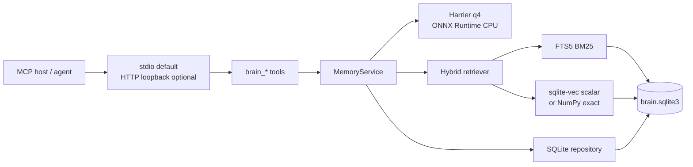

# Another Brain Architecture

## Status

This document is the approved architecture for the `v0.11.0` clean rebuild.
Implementation is in progress. The current files under the old top-level
`src/` still represent the Redis/Docker runtime until their scheduled early
deletion; they are evidence, not the target design.

The complete legacy implementation remains available on `main` baseline
`edc0e57`. Compare it from a separate worktree when necessary:

```bash
git worktree add ../another-brain-main main
```

Do not copy Redis code back into `v0.11.0`, add a backend selector, or preserve
bug-compatible ranking. Plan 07 is the execution record and contains the gates,
task IDs, schema details, and release budgets.

## Product boundary

Another Brain is a standalone MCP-first timeline memory service. Many trusted
agent clients share one `brain_id`; `agent_id` records provenance and is not a
partition. The service owns:

- diary memory validation and lifecycle;
- local multilingual embedding;
- durable storage, lexical/vector retrieval, and fusion;
- identity binding and secret-free audit;
- MCP stdio and optional loopback HTTP surfaces.

It does not own an agent loop, persona, conversation framework, UI, truth
verification, server-side summarization LLM, or client-specific integration.
Calling agents normalize memories before `brain_remember`.

## Final runtime shape



No Docker daemon, Redis server, separate vector database, ANN sidecar, Torch,
SentenceTransformers, or hidden embedding daemon belongs to the final runtime.

## Package and process model

Final code lives under `src/another_brain/` and is installed as a real wheel.
The console script is:

```toml
[project.scripts]
another-brain = "another_brain.cli:main"
```

Normal installation and invocation:

```bash
uv tool install another-brain
another-brain
```

The bare command serves MCP stdio. Optional commands include localhost HTTP,
model management, doctor, recent/admin operations, and neutral JSONL import.
Harnesses invoke the installed executable, not an unpinned `uvx` command.

Independent stdio processes share one SQLite file through WAL. Each process has
a lazy process-local ONNX session in the MVP; the measured memory cost is a
release metric, not a reason to introduce a background daemon.

## Identity and trust

| Field | Meaning | Source |
|---|---|---|
| `brain_id` | storage isolation namespace | process config |
| `agent_id` | writer/audit provenance | MCP client handshake |
| `scope` | `user | project | global` | tool input |
| `scope_id` | stable id inside scope; global pins `global` | tool input/policy |

Every storage and retrieval query includes `brain_id`, `scope`, and `scope_id`.
Tool inputs never carry `brain_id` or `agent_id`.

There is no auth layer. The service is for trusted local agents; HTTP remains
loopback/private only. Memories are claims, not facts. Code/current evidence
wins; readers reinforce only after successful use and forget wrong memories.
`docs/memory-trust-model.md` remains the epistemic contract.

## Diary memory contract

One memory is one append-only timeline entry. Updates are a new remember plus a
forget of the old record; there is no merge or arbitrary token chunking.

Core fields:

```text
memory_id, brain_id, agent_id, scope, scope_id
topic, catalog, summary, content
timeline_day, period_start, period_end, created_at, updated_at
importance, expires_at, deleted_at, metadata_json
embedding_profile_id, embedding, record_version
```

- `topic` is a reusable stable retrieval subject, not a workflow label.
- `catalog` is an open lowercase-kebab classification; starter values remain
  bug, decision, preference, task, fact, and note.
- `summary` is one or two self-contained sentences containing the claim.
- `content` holds long detail, commands, hashes, and checklists.
- `importance` maps to 365/180/90/30/7-day retention for levels 5..1.
- Reads never renew retention. Only reinforce and restore re-arm it.
- Forget sets `deleted_at` and shortens expiry to the grace window without
  extending a shorter existing lifetime.

## Embedding contract

Default model: `microsoft/harrier-oss-v1-270m`, 640 dimensions, q4 ONNX
artifact. Runtime is raw ONNX Runtime CPU plus `tokenizers`. The graph output is
already `sentence_embedding FLOAT32[batch,640]`, last-token pooled and L2
normalized; application code must not pool/normalize it again.

Each memory stores exactly one little-endian FLOAT32 vector generated from:

```python
topic.replace("-", " ") + "\n" + summary.strip()
```

Documents are unprompted. Queries prepend the pinned Harrier
`web_search_query` instruction. `content`, catalog, metadata, identity, time,
and importance are not embedded.

All text budgets use the pinned tokenizer:

| Input | Hard limit | Special tokens counted |
|---|---:|---:|
| humanized topic | 12 (target 3–8) | no |
| final topic+summary document | 256 | yes |
| final prompt+query | 128 | yes |
| lexical-only content | 1,024 | no |

Over-limit inputs are rejected with actual/allowed counts. There is no silent
truncation or automatic chunking. Model/tokenizer/prompt/payload changes bump
`embedding_input_version` and require explicit re-embedding.

Pinned ONNX-community artifact revision:
`d59c919d0159aea2c19ed7d04288fcdd048d0f9c`.

Required q4 files:

- `onnx/model_q4.onnx` — SHA-256
  `228dca2603b907d673dd99cf89c309c0ca68baeed127416a5e027a48e62b0f49`
- `onnx/model_q4.onnx_data` — SHA-256
  `b5a15487360f5341659480ae4b5ad60028d5f865bd329196ec8d5708bbed3118`

## SQLite contract

One `brain.sqlite3` file in the platform-specific user data directory is the
source of truth. It contains:

- checksummed schema migrations;
- an embedding profile record;
- ordinary `memories` rows with `CHECK(length(embedding)=2560)`;
- external-content FTS5 table and synchronization triggers;
- secret-free audit events.

Default per-connection policy:

```text
foreign_keys = ON
journal_mode = WAL
synchronous = NORMAL
busy_timeout = 5000 ms
page_size = 16384 before first schema creation
```

Writes use short `BEGIN IMMEDIATE` transactions and bounded busy retry. No
model inference, tokenization, or network I/O occurs inside a transaction.
Schema/model installation is cross-process locked and crash-safe.

`expires_at` and `deleted_at` are durable. Every get/recent/lexical/vector path
filters expired and deleted rows before branch limits. Cleanup is bounded and
opportunistic; correctness never depends on a sweeper.

## Retrieval contract

Hybrid retrieval has independent branches:

1. **Lexical** — FTS5 over `topic`, `summary`, `content` using
   `unicode61 remove_diacritics 2` and initial BM25 weights `5:3:1`.
2. **Vector** — exact cosine over regular FLOAT32 BLOBs through sqlite-vec
   scalar functions; NumPy exact scan is the compatibility fallback.
3. **Fusion** — equal-weight RRF, `k=60`, deterministic tie break.

For `top_k`, each branch requests
`min(max(4 * top_k, 40), 200)` candidates after mandatory live/scope filters.
Vector candidates below cosine 0.30 are removed before fusion. Lexical-only
candidates remain eligible without a cosine gate. This intentionally fixes the
legacy bug where an exact identifier found only in `content` could be discarded
because its topic+summary vector was dissimilar.

A punctuation-only/no-safe-term query skips FTS5 and uses vector retrieval.
Final results expose branch evidence but never embeddings.

## Module boundaries

```text
src/another_brain/
  cli.py, app.py, config.py
  domain/       models and retention
  embedding/    manifest, installer, provider, payload, budgets
  storage/      connection, schema, memory repository, audit
  retrieval/    safe query, lexical, vector, fusion, orchestration
  mcp/          tools and transports
```

Protocols isolate the service for tests; they are not a plugin/backend system:

```text
MemoryRepository
MemoryRetriever
AuditRepository
EmbeddingProvider
```

No `STORAGE_BACKEND` setting exists.

## Migration and branch policy

- `main` baseline `edc0e57` is the external Redis/Docker oracle.
- `v0.11.0` establishes the final package shell, then removes Redis, Docker,
  and Torch before implementing new persistence/retrieval.
- If existing data needs migration, a maintenance branch based on `main`
  produces versioned neutral JSONL.
- The clean branch imports JSONL, preserves identity/timestamps/metadata/
  remaining lifetime/deletion/audit state, and re-embeds topic+summary under
  input version 2.
- Import is resumable and idempotent. The clean release never imports Redis.

## Supported target

Required release matrix: Windows x86_64, macOS 14+ ARM64, and Ubuntu
22.04/24.04 x86_64 on Python 3.12–3.14. Linux ARM64 and Windows ARM64 are
best-effort/fallback targets. macOS Intel and musl are explicit non-goals for
the initial clean release because the selected runtime wheel matrix does not
support them consistently.

## Non-goals

- Redis/Docker compatibility inside the clean runtime;
- permanent dual storage backends;
- ANN/vector sidecar indexes;
- server-side LLM normalization or automatic ingest;
- silent text truncation/chunking;
- auth/permissions for untrusted remote users;
- automatic precision selection by hardware;
- zero-downtime Redis migration.

## Execution source

`.agents/plans/07-multiplatform-embedded-runtime.md` is the only active
implementation plan. Historical plans 01–05 explain how the legacy runtime was
built but are superseded for `v0.11.0`. Plan 06 and the trust model remain
applicable where they do not conflict with this architecture.
