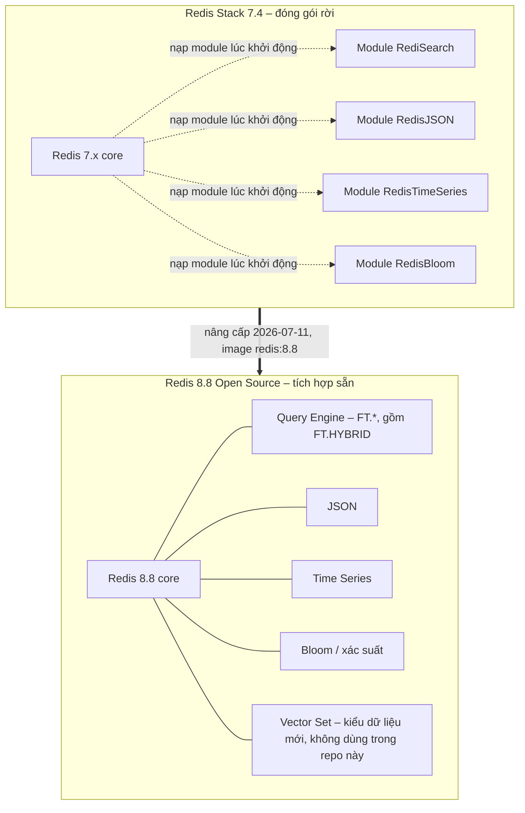
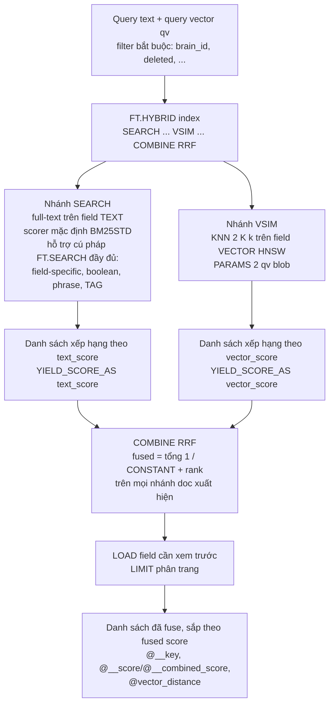
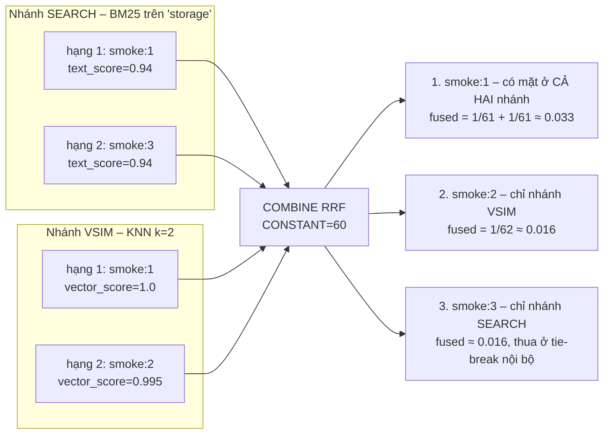
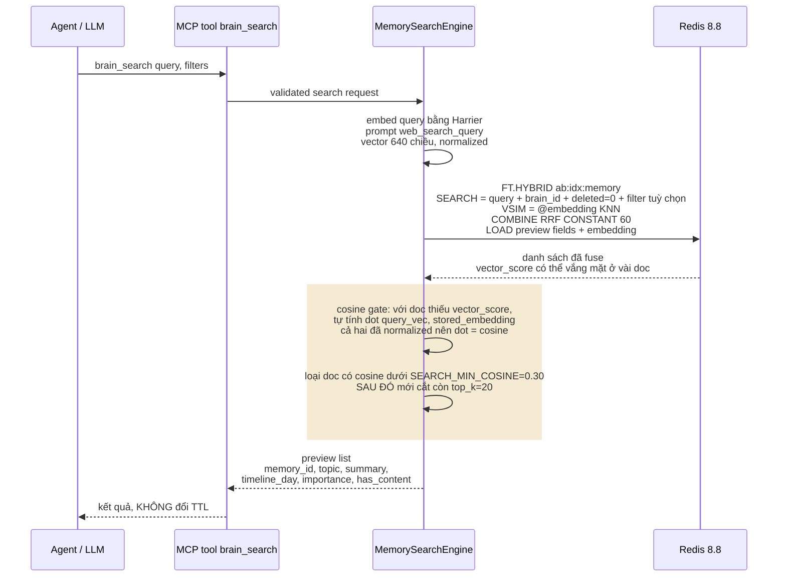

# Step 05 - FT.HYBRID trên Redis 8.8

> **Superseded for `v0.11.0` (2026-07-31).** This file is retained as
> Redis-era architecture history and legacy-oracle evidence. The approved
> target is `.agents/plans/another-brain-architecture.md`; execution is Plan
> 07. Do not implement new runtime behavior from this document.


Tài liệu giải thích, không phải tài liệu quyết định. Mục đích: cho thấy cơ chế
`FT.HYBRID` hoạt động thế nào trước khi duyệt thiết kế search chính thức
(bước tiếp theo). Repo đã nâng `docker/docker-compose.yml` lên image
`redis:8.8`; tài liệu này giải thích tại sao và điều đó thay đổi gì cho
`MemorySearchEngine`.

## 1. Redis Stack vs Redis 8 là gì



"Redis Stack" chỉ là cách đóng gói cũ: Redis core cộng các module rời
&#40;RediSearch, RedisJSON...&#41; nạp cùng lúc. Từ Redis Open Source 8.x, các
module này được gộp thẳng vào binary chính dưới tên "Query Engine" và các
tính năng liên quan — không còn khái niệm "Stack" nữa, chỉ còn một image
`redis:<version>`. Repo dùng `embedding` là field `VECTOR HNSW` bên trong
Query Engine &#40;Section 3, Step 04&#41;, **không** dùng kiểu dữ liệu Vector
Set mới — hai thứ khác nhau, đừng nhầm.

`FT.HYBRID` xuất hiện từ Redis 8.4.0. Repo chọn **8.8.0** &#40;GA tháng
5/2026&#41; vì 8.8 sửa thêm vài bug hybrid search: race condition khi nhiều
hybrid query chạy đồng thời, `VSIM` với `RANGE` + `FILTER` trả về 0 kết quả
sai, memory leak khi `FT.DROPINDEX` đồng thời — cộng thêm giới hạn ứng viên
theo shard và hỗ trợ `FT.PROFILE` cho hybrid query. Client bắt buộc
`redis-py >= 7.1`; repo đã lên `8.0.1`.

## 2. FT.HYBRID hoạt động thế nào



Một lệnh `FT.HYBRID` chạy **hai nhánh song song trong Redis** rồi tự fuse:
nhánh `SEARCH` chấm điểm BM25STD trên field TEXT &#40;`summary`, `content`&#41;,
nhánh `VSIM` chạy KNN trên field VECTOR HNSW &#40;`embedding`&#41;. `COMBINE RRF`
cộng dồn `1 / &#40;CONSTANT + rank&#41;` qua từng nhánh — doc nào khớp cả hai
nhánh thì cộng hai lần, nên tự nhiên nổi lên đầu danh sách.

| Tham số | Mặc định | Ghi chú |
| --- | --- | --- |
| `CONSTANT` | 60 | trùng khớp `SEARCH_FUSION_K=60` đã đóng băng ở Step 04 — không cần tune lại |
| `WINDOW` | 20 | số ứng viên top của mỗi nhánh được đưa vào fusion |
| `LIMIT` | 10 | mặc định của `FT.HYBRID`; `brain_search` sẽ set theo `SEARCH_TOP_K=20` |

Field dành riêng trong kết quả: `@__key` &#40;key của doc&#41;,
`@__score`/`@__combined_score` &#40;điểm đã fuse&#41;, `@vector_distance`
&#40;khoảng cách thô từ nhánh VSIM, nếu doc có mặt ở nhánh đó&#41;.

## 3. Ví dụ thật trên container

Smoke test chạy trực tiếp trên container hôm nay &#40;2026-07-11&#41;.

Tạo index và 3 doc:

```redis
FT.CREATE smoke:idx ON HASH PREFIX 1 smoke:
  SCHEMA summary TEXT vec VECTOR HNSW 6 TYPE FLOAT32 DIM 4 DISTANCE_METRIC COSINE
```

| Key | summary | vec | Ghi chú |
| --- | --- | --- | --- |
| `smoke:1` | "redis storage layer" | `[1, 0, 0, 0]` | khớp cả text lẫn vector |
| `smoke:2` | "vector database engine" | `[0.99, 0.14, 0, 0]` | chỉ khớp vector |
| `smoke:3` | "storage cabinet recipe" | `[0, 0, 0, 1]` | chỉ khớp text, vector ở xa |

Truy vấn — tìm `"storage"` bằng BM25, đồng thời KNN k=2 tới
`qv = [1, 0, 0, 0]`:

```redis
FT.HYBRID smoke:idx
  SEARCH "storage" YIELD_SCORE_AS text_score
  VSIM @vec $qv KNN 2 K 2 YIELD_SCORE_AS vector_score
  COMBINE RRF 2 CONSTANT 60
  LOAD 4 @__key @text_score @vector_score @summary
  PARAMS 2 qv <blob của [1,0,0,0]>
```

Kết quả thật &#40;RESP3 map, `total_results=3`&#41;:

| Thứ hạng | Key | text_score | vector_score |
| --- | --- | --- | --- |
| 1 | `smoke:1` | 0.94 | 1.0 |
| 2 | `smoke:2` | — vắng mặt | 0.995 |
| 3 | `smoke:3` | 0.94 | — vắng mặt |

`vector_score` là độ tương đồng đã chuẩn hoá:
`vector_score = 1 - cosine_distance / 2`.



`smoke:1` thắng rõ ràng vì nó là doc duy nhất được cả hai nhánh chấm điểm —
mỗi nhánh đóng góp `1/61` vào tổng, còn `smoke:2` và `smoke:3` chỉ có một
nhánh đóng góp `1/62` nên xấp xỉ ngang nhau, thứ tự giữa chúng do Redis
tie-break nội bộ &#40;không quan trọng bằng việc `smoke:1` bubble lên đầu&#41;.

> **Lưu ý quan trọng**: `smoke:3` khớp nhánh SEARCH nhưng **không có
> `vector_score`** — Redis chưa từng tính khoảng cách của nó tới query
> vector, vì nó không lọt vào top-K của nhánh VSIM. Nghĩa là: với những doc
> chỉ đến từ nhánh BM25, muốn áp ngưỡng chất lượng cosine tối thiểu thì phải
> **tự tính ở phía client**, Redis không tính hộ.

## 4. brain_search sẽ dùng nó ra sao



So với thiết kế cũ &#40;Step 04 §6.4, hai lệnh `FT.SEARCH` + RRF thủ công
trong Python&#41;, giờ chỉ còn **một lệnh `FT.HYBRID`** làm cả KNN, BM25 và
RRF trong Redis. Phần Python co lại còn đúng cosine gate: vì doc chỉ khớp
BM25 không có `vector_score` &#40;mục 3&#41;, engine tự tính cosine cho những
doc đó từ `embedding` đã `LOAD` về, loại bỏ doc dưới `SEARCH_MIN_COSINE=0.30`,
**rồi mới** cắt còn `SEARCH_TOP_K=20` — đúng thứ tự "gate trước, limit sau"
đã chốt ở Step 04 quyết định 10 &#40;march7 fix B3&#41;: nếu limit trước, vài
slot top-20 có thể bị chiếm bởi rác BM25 chưa qua gate.

## 5. Thay đổi trong repo

| Hạng mục | Trước – 7.4 | Sau – 8.8 |
| --- | --- | --- |
| Image | `redis/redis-stack-server:7.4.0-v8` | `redis:8.8` |
| Khởi động container | `REDIS_ARGS` env, entrypoint riêng của Stack | `command` tường minh `redis-server --appendonly yes`; image chính thức không có entrypoint Stack, chạy dưới uid 999 |
| redis-py tối thiểu | không ràng buộc rõ | `>= 7.1`, repo dùng `8.0.1` |
| Số round trip search | 2 &#40;`FT.SEARCH` KNN + `FT.SEARCH` BM25&#41; | 1 &#40;`FT.HYBRID`&#41; |
| Code fusion phía client | tính rank, RRF, gate, limit | chỉ còn cosine gate + limit |
| Server tối thiểu cho `FT.HYBRID` | không hỗ trợ | `8.4.0`; repo chọn `8.8` để có các fix bug hybrid + `FT.PROFILE` |

## Nguồn

- https://redis.io/docs/latest/commands/ft.hybrid/
- https://redis.io/docs/latest/develop/whats-new/8-8/
- https://redis.io/blog/revamping-context-oriented-retrieval-with-hybrid-search-in-redis-84/
- https://github.com/redis/redis/blob/8.8/00-RELEASENOTES
