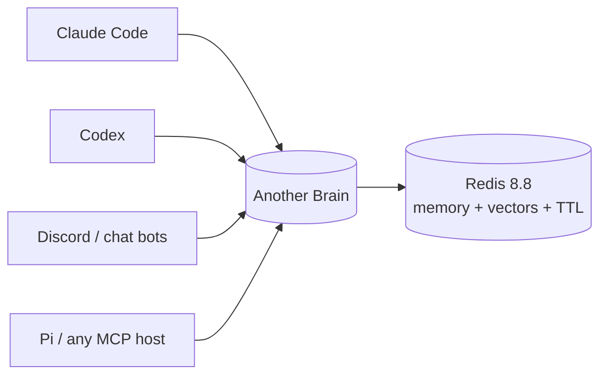
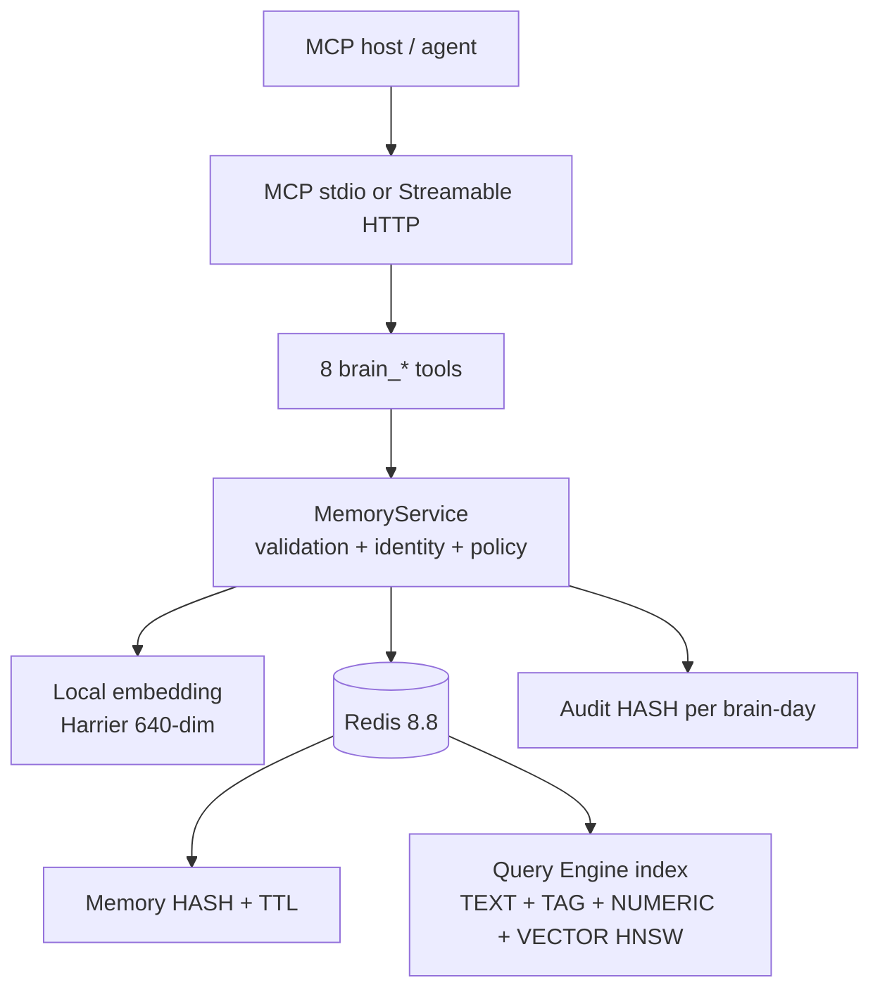

# Another Brain

One shared long-term memory for all your AI agents — a self-hosted MCP
server with hybrid search, local multilingual embeddings, and self-expiring
memory.

## Why this exists

If you work with more than one AI agent — Claude Code, Codex, a Discord
bot, a local assistant — each one either remembers nothing or remembers in
its own silo. A bug fixed in a Claude session is invisible to Codex the
next morning. Every harness that does ship memory quietly re-implements the
same stack: storage, embeddings, retrieval, retention — and none of them
share with each other.

Another Brain pulls memory out of the agents and into one service they all
connect to. Anything one agent stores is recallable by every other agent on
the same `brain_id`. It is built around four opinions:

- **Memory belongs to the brain, not the agent.** Agents come and go;
  the brain persists. Identity (`agent_id`) is provenance, not a partition.
- **The writer normalizes, the server stores.** There is no LLM inside
  this service. The calling agent already runs a strong model with full
  context, so it writes the topic, summary, and importance; the server only
  embeds and stores. Local footprint stays under ~1 GB.
- **Memory should expire.** Every entry carries an importance-derived
  TTL, and only an explicit `brain_reinforce` renews it after real use.
  The system fails toward forgetting, never toward bloat.
- **Recall is claims, not facts.** Search returns unverified assertions
  written by past agents — see the
  [trust model](docs/memory-trust-model.md) for why this is a feature.



## What you get

- **Eight MCP tools** — the whole surface:

  | Tool | Purpose |
  | --- | --- |
  | `brain_remember` | Append a diary entry (topic + 1-2 sentence summary, optional detail) |
  | `brain_search` | Hybrid semantic + keyword search, preview lines only |
  | `brain_recent` | Newest entries on the timeline, no query needed |
  | `brain_get` | Full detail for one memory |
  | `brain_reinforce` | Renew retention after a memory proved useful — the only TTL renewal |
  | `brain_forget` | Soft-delete what proved wrong (30-day admin-recoverable grace) |
  | `brain_health` | Service + index + identity status |
  | `brain_audit` | Secret-free mutation trail (who/what/when, never the text) |

  Full parameter contracts: [`docs/mcp-tools.md`](docs/mcp-tools.md).
- **Timeline (diary) memory** — one memory = one dated entry; append-only,
  an update is a new `brain_remember` plus a `brain_forget`.
- **Redis-native hybrid recall** — one `FT.HYBRID` call fuses BM25 and
  vector KNN inside Redis 8.8; a cosine floor gates quality before top-k.
- **Retention by importance** — 5=365d, 4=180d, 3=90d, 2=30d, 1=7d.
  Reads never extend TTL.
- **Local multilingual embeddings** — Harrier 270M (640-dim), runs
  offline, handles Vietnamese + English without a translation pipeline.

## Architecture



Design rationale and step contracts: [`.agents/plans/`](.agents/plans).

## Quick start

Docker is the install shape — it brings up Redis 8.8 and the MCP server
(HTTP transport), and downloads the embedding model into a volume on first
boot:

```bash
git clone <this repo> && cd another-brain
docker compose -f docker/docker-compose.yml up -d --build
```

Defaults work out of the box (`BRAIN_ID=default`, Redis on 6379, MCP on
8000); create a `.env` and pass `--env-file .env` only to override them.

The server is then reachable at `http://localhost:8000/mcp`. Model
management and the dev (from-source) flow:
[`docs/deployment.md`](docs/deployment.md).

## Connect your agents

**1. Register the MCP server** with each host — stdio (from a checkout):

```json
{
  "mcpServers": {
    "another-brain": {
      "command": "uv",
      "args": ["run", "python", "src/main.py", "serve"]
    }
  }
}
```

or point the host at the Streamable HTTP endpoint above. Keep `BRAIN_ID`
identical everywhere — sharing the brain is the point. `agent_id` needs no
configuration: the server detects each client from the MCP handshake.

**2. Install the bundled `brain-memory` skill** so agents learn the recall
loop (search before answering, remember what matters, reinforce or forget
after use):

```bash
npx skills add Flowerf19/another-brain --skill brain-memory -g
```

Without the skill the tools still work, but agents only discover the
workflow from it.

## Configuration

All settings are environment variables (`.env` is loaded automatically;
real environment variables win). Every inconsistency is a startup error.
The useful subset:

| Variable | Default | Purpose |
| --- | --- | --- |
| `BRAIN_ID` | `default` | Brain namespace this server writes to |
| `REDIS_URL` | `redis://localhost:6379` | Redis >= 8.4 (Query Engine required) |
| `EMBEDDING_MODEL` / `EMBEDDING_DIM` | `microsoft/harrier-oss-v1-270m` / `640` | Local embedding model |
| `MODEL_DOWNLOAD_POLICY` | `manual` | `disabled` / `manual` / `lazy` / `on_start` |
| `SEARCH_TOP_K` / `SEARCH_MIN_COSINE` | `20` / `0.30` | Recall page size and quality floor |
| `TTL_IMPORTANCE_5`...`TTL_IMPORTANCE_1` | 365d...7d | All-or-none override set |
| `FORGET_GRACE_SECONDS` | `2592000` | Soft-delete recovery window |
| `TIMELINE_TIMEZONE` | `Asia/Ho_Chi_Minh` | `timeline_day` derivation |
| `MCP_HTTP_HOST` / `MCP_HTTP_PORT` | `127.0.0.1` / `8000` | HTTP transport bind |

Changing `EMBEDDING_DIM` against an existing index refuses startup — a
reindex is required (migration tooling is not implemented yet).

## Safety & trust

- **No auth layer, by design.** Every connected caller can read and write
  the whole brain. Bind the HTTP transport to localhost or a private
  network only.
- **Memories are claims, not facts.** Treat recall like advice from a
  colleague, not ground truth: [`docs/memory-trust-model.md`](docs/memory-trust-model.md).
- **No secrets in memory or audit.** The audit trail records actions and
  ids, never memory text; don't store credentials in memories either.

## Development

```bash
uv sync --extra local        # deps + local model support
uv run pytest                # full suite (integration needs the compose Redis)
uv run pytest tests/unit     # unit only, no Redis needed
```

Layout: `src/` (`main.py` CLI, `app.py` composition root, `server/` MCP
surface, `memory/` domain, `storage/` Redis, `models/` local model install,
`audit/` mutation trail), `docker/`, `skills/brain-memory/`, `tests/`.
Testing contract: [`.agents/TESTING_GUIDE.md`](.agents/TESTING_GUIDE.md).

## For agents working in this repo

Start with [`.agents/README.md`](.agents/README.md) — read order, module
ownership, and the rules that keep these docs honest.
