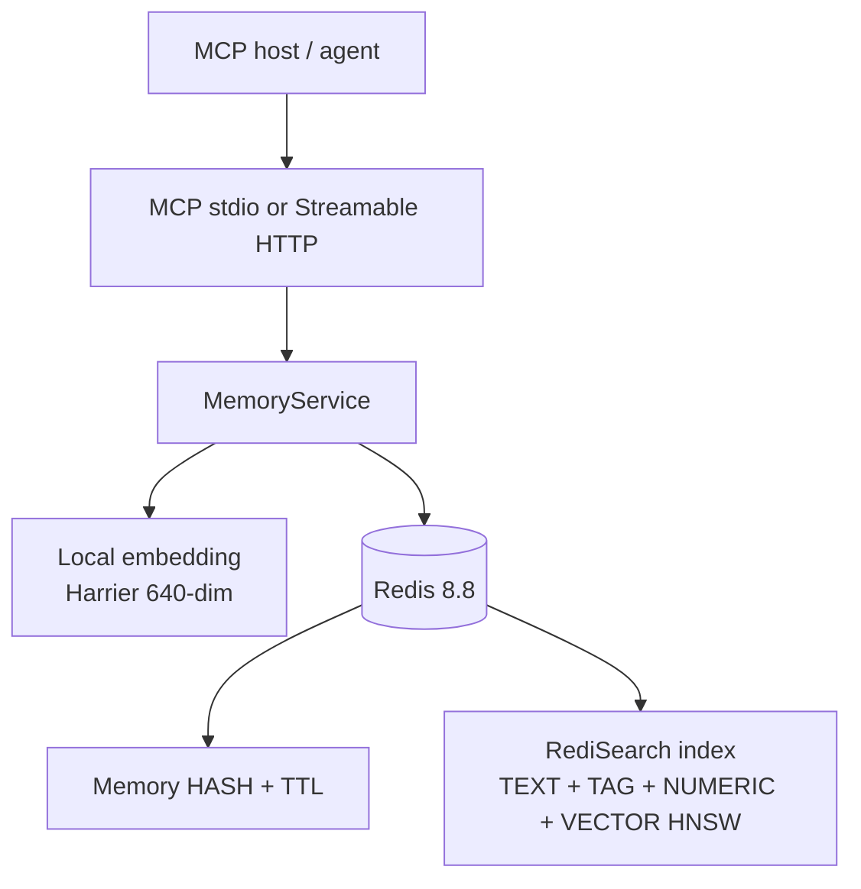

# Another Brain

Standalone timeline memory for MCP-capable agents.

Another Brain is a memory service for agent systems such as Claude, Codex,
Discord bots, local chat bots, and other MCP hosts. It owns long-term memory
storage, recall, identity boundaries, and retrieval policy so client agents do
not need to implement their own memory stack. One shared brain, many agents:
knowledge stored by one agent is recallable by every other agent on the same
`brain_id`.

## Key Ideas

- **MCP-first integration**: eight stable tools — `brain_remember`,
  `brain_search`, `brain_recent`, `brain_get`, `brain_reinforce`,
  `brain_forget`, `brain_health`, `brain_audit`.
- **Timeline (diary) memory**: one memory = one dated entry —
  `timeline_day` + `topic` slug + 1-2 sentence `summary`, classified by an
  open `catalog` vocabulary, with optional `content` detail/checklist.
  Append-only: updates are a new `brain_remember` plus a `brain_forget`.
- **Redis-native hybrid recall**: Redis 8.8 (bundled Query Engine) stores one
  HASH per memory with a packed FLOAT32 embedding. A single `FT.HYBRID` call
  fuses BM25 and vector KNN with RRF inside Redis; the app applies a cosine
  floor before cutting to top-k.
- **Retention by importance**: each key's TTL derives from importance
  (5=365d ... 1=7d). Reads never extend TTL — only an explicit
  `brain_reinforce` renews a memory after it proved useful. `brain_forget`
  soft-deletes with a 30-day admin-recoverable grace window. The system fails
  toward forgetting, never toward bloat.
- **No auth layer**: the service is a shared brain for trusted agents.
  `brain_id` is bound from server config; `agent_id` is detected per session
  from the MCP handshake. Tool inputs never carry identity. Do not expose
  the HTTP transport on untrusted networks.
- **Memories are claims, not facts**: recall returns unverified assertions
  by past agents. The trust model — contamination vectors, defenses, and the
  reader/writer stance — is in
  [`docs/memory-trust-model.md`](docs/memory-trust-model.md).

## Architecture



Canonical design docs: [`.agents/plans/another-brain-architecture.md`](.agents/plans/another-brain-architecture.md)
and the approved step contracts in `.agents/plans/01`–`05`.

## Prerequisites

- Python >= 3.12, managed with [uv](https://docs.astral.sh/uv/)
- Docker (for the Redis 8.8 dev instance; any Redis >= 8.4 with the Query
  Engine works — `FT.HYBRID` is required)

## Quick Start

```bash
uv sync --extra local                          # install deps + local model support
docker compose -f docker/docker-compose.yml up -d   # Redis 8.8 on REDIS_PORT

MODEL_ALLOW_NETWORK=true \
  uv run python src/main.py model pull --kind embedding   # one-time, ~270M model

uv run python src/main.py serve                # MCP over stdio
uv run python src/main.py serve --transport http      # or Streamable HTTP
```

Copy the env template values you need into `.env` (loaded automatically; real
environment variables win). Minimal local setup:

```text
REDIS_PORT=1905
REDIS_URL=redis://localhost:1905
BRAIN_ID=flowerf-main
```

## Configuration

All settings are environment variables read by `src/config.py` (every
inconsistency is a startup error). The useful subset:

| Variable | Default | Purpose |
| --- | --- | --- |
| `BRAIN_ID` | `default` | Brain namespace this server writes to |
| `REDIS_URL` | `redis://localhost:6379` | Redis >= 8.4 connection |
| `EMBEDDING_MODEL` / `EMBEDDING_DIM` | `microsoft/harrier-oss-v1-270m` / `640` | Local embedding model |
| `MODEL_DOWNLOAD_POLICY` | `manual` | `disabled`/`manual`/`lazy`/`on_start` |
| `SEARCH_TOP_K` / `SEARCH_MIN_COSINE` | `20` / `0.30` | Recall page size and quality floor |
| `TTL_IMPORTANCE_5`...`TTL_IMPORTANCE_1` | 365d...7d | All-or-none override set |
| `FORGET_GRACE_SECONDS` | `2592000` | Soft-delete recovery window |
| `TIMELINE_TIMEZONE` | `Asia/Ho_Chi_Minh` | `timeline_day` derivation |
| `MCP_HTTP_HOST` / `MCP_HTTP_PORT` | `127.0.0.1` / `8000` | HTTP transport bind |

`agent_id` needs no configuration: the server detects each client from the
MCP handshake (`clientInfo`) per session and records it as provenance on
writes and audit events.

Changing `EMBEDDING_DIM` against an existing index refuses startup — a reindex
migration is required (Step 04 §5; migration tooling is not implemented yet).

## Connect Agents

Register the MCP server with your host (stdio config in
`docs/deployment.md`), then install the bundled `brain-memory` skill
(`npx skills add Flowerf19/another-brain`) so agents learn the recall loop:
search before answering, remember what matters, reinforce or forget after
use. Full runbook: [`docs/deployment.md#connect-agents`](docs/deployment.md).

## Development

```bash
uv run pytest              # full suite: unit + integration (needs dev Redis up)
uv run pytest tests/unit   # unit only, no Redis needed
```

Layout: `src/` (`main.py` CLI, `app.py` composition root, `server/` MCP
surface, `memory/` domain, `storage/` Redis, `models/` local model install,
`audit/` mutation trail), `tests/unit` + `tests/integration`. Stubs not yet
implemented: `server/resources.py`, `storage/migrations.py`,
`memory/normalization.py`, `packages/npm-launcher`, service Dockerfile.

See `.agents/TESTING_GUIDE.md` for the integration-test Redis contract and
`docs/mcp-tools.md` for the tool surface.

## For Agents

Start with [`.agents/README.md`](.agents/README.md). Keep the public README,
the plans, and `.agents` guidance synchronized as the repo grows.
