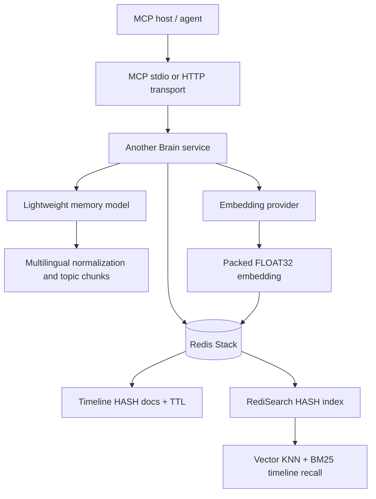

# Another Brain

Standalone timeline memory for MCP-capable agents.

Another Brain is a planned memory service for agent systems such as Claude,
Codex, Discord bots, local chat bots, and other MCP hosts. It is designed to
own long-term memory storage, recall, identity boundaries, language
normalization, and retrieval policy so client agents do not need to implement
their own memory stack.

> Status: architecture draft. This repository currently contains planning,
> agent guidance, and a non-runnable placeholder scaffold. Runtime
> implementation, package manifests, Docker files, and executable tests have not
> been added yet.

## Architecture Plan

The detailed architecture plan lives here:

[`.agents/plans/another-brain-architecture.md`](.agents/plans/another-brain-architecture.md)

Read that plan before implementing storage, MCP tools, chunking, identity, or
packaging. It is the current source of truth for product and technical
decisions.

## Key Ideas

- **MCP-first integration**: expose memory through small, stable MCP tools such
  as `brain_remember`, `brain_search`, `brain_recent`, `brain_get`,
  `brain_forget`, and `brain_health`.
- **Shared brain namespace**: use `brain_id` as the storage isolation boundary
  and `agent_id` as provenance and permission context.
- **Timeline memory**: store dated memory entries, not generic key-value notes.
  A memory chunk represents a semantic topic over a time window.
- **Redis-native recall**: Redis Stack stores memory HASH documents, packed
  FLOAT32 embeddings, RediSearch text/vector indexes, and per-memory TTL. Vector
  KNN and BM25 both run through Redis `FT.SEARCH`.
- **Multilingual canonical memory**: preserve the memory's natural language by
  default, while recording language metadata and allowing optional translation
  policy when a deployment needs it.
- **Preserve source context**: keep original content/language when normalization
  changes the source text or when audit/debug needs it.
- **Local-first deployment**: Docker is the intended primary deployment shape;
  npm should be a convenience MCP launcher/adapter, not a second memory engine.

## Intended Architecture



The MVP storage backend is expected to be Redis Stack. It is not just metadata
storage: it owns the memory HASH records, packed vector field, retention TTL,
and RediSearch index used for both semantic KNN and BM25 lexical search.

## Planned Memory Model

Another Brain stores timeline records with fields such as:

- `memory_id`
- `brain_id`
- `agent_id`
- `scope` / `scope_id`
- `subject_id`
- `topic` and `topic_display`
- canonical multilingual `content`
- `original_content` and `original_language`
- `canonical_language`
- `period_start`, `period_end`, and `timeline_day`
- `source_event_ids`
- `importance`, `confidence`, and tags
- packed FLOAT32 `embedding`
- `memory_model`, `embedding_model`, and `embedding_dim`

Redis Stack should store these records as HASH documents. The embedding belongs
on the same HASH as packed FLOAT32 bytes, while RediSearch indexes text, tag,
numeric time fields, and the vector field together. That is what keeps timeline
storage, retention, semantic search, and BM25 search aligned.

The chunking reference is March7's current T2 diary model:

https://github.com/Flowerf19/March7/tree/main/twin/shared/memory/diary

That reference currently stores 12 Redis HASH fields, indexes 11 RediSearch
fields, and adds returned fields such as `summary_id`, KNN `score`, and BM25
`_score` at query time. The detailed field inventory is in the architecture
plan.

Use it as a behavior reference only. Another Brain should remain an independent
repo and service.

## Embedding Direction

The current architecture direction is multilingual recall with
`microsoft/harrier-oss-v1-270m` as the preferred default embedding model.

| Model | License | Params | Dim | Max tokens | Notes |
| --- | --- | ---: | ---: | ---: | --- |
| `microsoft/harrier-oss-v1-270m` | MIT | 268M | 640 | 32,768 | Preferred default: open license, strong Multilingual MTEB v2 score, moderate Redis vector size. |
| `Qwen/Qwen3-Embedding-0.6B` | Apache-2.0 | 596M | 1,024 | 32,768 | Strong fallback when memory/VRAM budget allows; larger Redis vectors. |
| `jinaai/jina-embeddings-v5-text-nano` | CC-BY-NC-4.0 | 212-239M | 768 | 8,192 | Good benchmark candidate, but non-commercial license and custom code make it unsuitable as the default. |

Redis vector cost before index overhead is `embedding_dim * 4` bytes per
memory: Harrier is 2.5 KB/chunk, Qwen3-0.6B is 4 KB/chunk, and Jina v5 nano is
3 KB/chunk.

References: [Harrier](https://huggingface.co/microsoft/harrier-oss-v1-270m),
[Qwen3 Embedding 0.6B](https://huggingface.co/Qwen/Qwen3-Embedding-0.6B),
[Jina v5 text nano](https://huggingface.co/jinaai/jina-embeddings-v5-text-nano),
and [MTEB Leaderboard](https://huggingface.co/spaces/mteb/leaderboard).

## Repository Layout

Current layout:

```text
another-brain/
  README.md
  docs/
    architecture.md
    mcp-tools.md
    deployment.md
  src/
    app.py
    main.py
    auth/
    mcp/
    memory/
    storage/
    models/
    audit/
  docker/
    README.md
  packages/
    npm-launcher/
      README.md
      src/
  tests/
    unit/
    integration/
  .agents/
    README.md
    PROJECT_CONTEXT.md
    AGENT_RULES.md
    TESTING_GUIDE.md
    plans/
      another-brain-architecture.md
```

Planned implementation layout is described in the architecture plan.

## Development Status

No runtime implementation exists yet. The `src/`, `docs/`, `docker/`,
`packages/`, and `tests/` paths are placeholders for the reviewed architecture.
There are currently no verified commands for installation, local development,
tests, linting, or Docker startup.

When implementation starts, add exact commands here and mirror operational
details in `.agents/TESTING_GUIDE.md`.

## Configuration

The architecture plan defines expected future configuration names, including:

- `ANOTHER_BRAIN_ID`
- `ANOTHER_BRAIN_AGENT_ID`
- `ANOTHER_BRAIN_API_TOKEN`
- `MEMORY_MODEL_PROVIDER`
- `MEMORY_MODEL_NAME`
- `MEMORY_CANONICAL_LANGUAGE`
- `MEMORY_TRANSLATION_POLICY`
- `EMBEDDING_PROVIDER`
- `EMBEDDING_MODEL`
- `EMBEDDING_DIM`

Do not treat these as working runtime env vars until the implementation lands.

## For Agents

Start with [`.agents/README.md`](.agents/README.md). Keep the public README,
the architecture plan, and `.agents` guidance synchronized as the repo grows.
